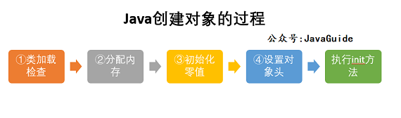

# 计算机网络

1. **为什么端口数量最大限制为65535？**

   在TCP、UDP协议的开头，会分别有16位来存储源端口号和目标端口号，所以端口个数是2^16-1=65535个

   Tcp客户端连接服务端的时候，需要获取本地的临时端口，传输层协议限制了最多只有65535个端口

# Java基础

## 1. JVM

1. **jvms Java虚拟机规范第七章介绍Java汇编指令**(用于jvm)

   new：开辟空间 

   invokespecial：调用构造方法

   astore_1：建立关联

2. **对象的创建过程**

3. **DCL为什么需要volatile关键字**

4. **Java对象的内存布局**（JOL<java object layout>包可以辅助查看内存布局）

   ps.内部补齐需要了解

   ```String s = ClassLayout.parseInstance(t).toPrintable()```

   对象头包含**markword**和**class pointer**，**实例数据**和**对齐**，一共这四部分构成对象的内存布局

   **markword**中记录了hashcode，锁信息，GC信息(年龄，三色标记)

   64位虚拟机中，markword占用**8**字节，classpointer占用**4**字节(64位默认开启指针压缩，原本是8字节)。对齐部分以**8**字节对齐

   开启指针压缩后，最大支持内存为32G，2^32*8=32G，java虚拟机按照8字节对齐所以最大支持堆内存32G。

   这里的32G指的是-XX:+UseCompressedOops压缩对象指针。-XX:-UseCompressedClassPointers压缩类指针最大只允许4G的Klass地址。这项限制也意味着，JVM 需要向 Metaspace 分配一个**连续的地址空间**。这个连续的存储类的空间是-XX:CompressedClassSpaceSize，默认1G，最大支持3G(不是4G)

   > 注意，对象指针压缩要求堆小于 32G，所以如果堆大于等于 32G，那么对象指针压缩和类指针压缩都会被关闭。
   
    **思考一个问题，如果堆空间超过 32G 可以使用压缩吗？**
   
   其实可以，比如我们可以通过 padding 的方式让 Java 对象的大小保持为 16 字节的倍数，那么就可以扩展到 64G 的内存了。
   
    > -XX:ObjectAlignmentInBytes=16

   目前最新版本jdk支持44位寻址，ZGC需要4位用作colored pointer颜色

   **对齐填充部分不是必然存在的，也没有什么特别的含义，仅仅起占位作用。** 因为 Hotspot 虚拟机的自动内存管理系统要求对象起始地址必须是 8 字节的整数倍，换句话说就是对象的大小必须是 8 字节的整数倍。而对象头部分正好是 8 字节的倍数（1 倍或 2 倍），因此，当对象实例数据部分没有对齐时，就需要通过对齐填充来补全。

5. **``` Object o = new Object()``` 占用多少个字节**

   64位虚拟机时，**一共16字节**。8字节markword，4字节对象指针(默认开启指针压缩)，对齐部分4字节。

```java
/*一共占用32字节*/
//对象头12字节
public class T {
    int m;//4字节
    long l;//8字节
    boolean b;//1字节，内补齐3字节
    String s = "hello";//4字节指针
}
```

​	```java -XX:+PrintCommandLineFlags -version```查看默认参数，其中有类指针压缩和普通对象指针压缩

​	```java -XX:+PrintFlagsFinal```显示所有参数

6. **对象怎么分配**

   栈(逃逸分析)


7. **逃逸分析**

   1.标量替换2.栈上分配3.同步消除
   
8. **直接内存**

   直接内存并不是 JVM 运行时数据区的一部分, 但也会被频繁的使用: 在 JDK 1.4 引入的 NIO 提供了基于 Channel 与 Buffer 的 IO 方式, 它可以使用 Native 函数库直接分配堆外内存, 然后使用**DirectByteBuffer**对象作为这块内存的引用进行操作(详见: Java I/O 扩展), 这样就避免了在 Java堆和 Native 堆中来回复制数据, 因此在一些场景中可以显著提高性能 

9. **pc计数器在执行native方法的时候记录undefined地址**

   这里的“pc寄存器”是在抽象的JVM层面上的概念——当执行Java方法时，这个抽象的“pc寄存器”存的是Java字节码的地址。实现上可能有两种形式，一种是相对该方法字节码开始处的偏移量，叫做bytecode index，简称bci；另一种是该Java字节码指令在内存里的地址，叫做bytecode pointer，简称bcp。

   对native方法而言，它的方法体并不是由Java字节码构成的，自然无法应用上述的“Java字节码地址”的概念。所以JVM规范规定，如果当前执行的方法是native的，那么pc寄存器的值**未定义**——是什么值都可以。

   **上面是JVM规范所定义的抽象概念，那么实际实现呢？**

   Java线程总是需要以某种形式映射到OS线程上。映射模型可以是1:1（原生线程模型）、n:1（绿色线程 / 用户态线程模型）、m:n（混合模型）。

   以HotSpot VM的实现为例，它目前在大多数平台上都使用1:1模型，也就是每个Java线程都直接映射到一个OS线程上执行。此时，native方法就由原生平台直接执行，并不需要理会抽象的JVM层面上的“pc寄存器”概念——原生的CPU上真正的PC寄存器是怎样就是怎样。就像一个用C或C++写的多线程程序，它在线程切换的时候是怎样的，Java的native方法也就是怎样的。

10. CAS是什么？

    compareAndSwap,底层实现是使用cpu指令（intel处理器） **lock cmpxchg**（compare and exchange）来实现的(hotspot)。**XCHG**指令具备原子性，CPU会自动加LOCK前缀。
    
11. 可作为 GC Roots 的对象包括下面几种:

    - 虚拟机栈(栈帧中的本地变量表)中引用的对象
    - 本地方法栈(Native 方法)中引用的对象
    - 方法区中类静态属性引用的对象
    - 方法区中常量引用的对象
    - 所有被同步锁持有的对象

### 1.1 对象的创建

下图便是 Java 对象的创建过程，我建议最好是能默写出来，并且要掌握每一步在做什么。 

**Step1:类加载检查**

虚拟机遇到一条 new 指令时，首先将去检查这个指令的参数是否能在常量池中定位到这个类的符号引用，并且检查这个符号引用代表的类是否已被加载过、解析和初始化过。如果没有，那必须先执行相应的类加载过程。

**Step2:分配内存**

在**类加载检查**通过后，接下来虚拟机将为新生对象**分配内存**。对象所需的内存大小在类加载完成后便可确定，为对象分配空间的任务等同于把一块确定大小的内存从 Java 堆中划分出来。**分配方式**有 **“指针碰撞”** 和 **“空闲列表”** 两种，**选择哪种分配方式由 Java 堆是否规整决定，而 Java 堆是否规整又由所采用的垃圾收集器是否带有压缩整理功能决定**。

**内存分配的两种方式：（补充内容，需要掌握）**

选择以上两种方式中的哪一种，取决于 Java 堆内存是否规整。而 Java 堆内存是否规整，取决于 GC 收集器的算法是"标记-清除"，还是"标记-整理"（也称作"标记-压缩"），值得注意的是，复制算法内存也是规整的


**内存分配并发问题（补充内容，需要掌握）**

在创建对象的时候有一个很重要的问题，就是线程安全，因为在实际开发过程中，创建对象是很频繁的事情，作为虚拟机来说，必须要保证线程是安全的，通常来讲，虚拟机采用两种方式来保证线程安全：

- **CAS+失败重试：** CAS 是乐观锁的一种实现方式。所谓乐观锁就是，每次不加锁而是假设没有冲突而去完成某项操作，如果因为冲突失败就重试，直到成功为止。**虚拟机采用 CAS 配上失败重试的方式保证更新操作的原子性。**
- **TLAB：** 为每一个线程预先在 Eden 区分配一块儿内存，JVM 在给线程中的对象分配内存时，首先在 TLAB 分配，当对象大于 TLAB 中的剩余内存或 TLAB 的内存已用尽时，再采用上述的 CAS 进行内存分配

**Step3:初始化零值**

内存分配完成后，虚拟机需要将分配到的内存空间都初始化为零值（不包括对象头），这一步操作保证了对象的实例字段在 Java 代码中可以不赋初始值就直接使用，程序能访问到这些字段的数据类型所对应的零值。

**Step4:设置对象头**

初始化零值完成之后，**虚拟机要对对象进行必要的设置**，例如这个对象是哪个类的实例、如何才能找到类的元数据信息、对象的哈希码、对象的 GC 分代年龄等信息。 **这些信息存放在对象头中。** 另外，根据虚拟机当前运行状态的不同，如是否启用偏向锁等，对象头会有不同的设置方式。

**Step5:执行 init 方法**

在上面工作都完成之后，从虚拟机的视角来看，一个新的对象已经产生了，但从 Java 程序的视角来看，对象创建才刚开始，`<init>` 方法还没有执行，所有的字段都还为零。所以一般来说，执行 new 指令之后会接着执行 `<init>` 方法，把对象按照程序员的意愿进行初始化，这样一个真正可用的对象才算完全产生出来。

### 1.2 对象的访问定位

建立对象就是为了使用对象，我们的 Java 程序通过栈上的 reference 数据来操作堆上的具体对象。对象的访问方式由虚拟机实现而定，目前主流的访问方式有**①使用句柄**和**②直接指针**两种：

1. **句柄：** 如果使用句柄的话，那么 Java 堆中将会划分出一块内存来作为句柄池，reference 中存储的就是对象的句柄地址，而句柄中包含了对象实例数据与类型数据各自的具体地址信息；

   

2. **直接指针：** 如果使用直接指针访问，那么 Java 堆对象的布局中就必须考虑如何放置访问类型数据的相关信息，而 reference 中存储的直接就是对象的地址。


**这两种对象访问方式各有优势。使用句柄来访问的最大好处是 reference 中存储的是稳定的句柄地址，在对象被移动时只会改变句柄中的实例数据指针，而 reference 本身不需要修改。使用直接指针访问方式最大的好处就是速度快，它节省了一次指针定位的时间开销。**

### 2. 四种Java引用

* 强引用。最常见的引用
* 软引用。空间不够时被回收（至于是否是正常gc回收，需要验证，可使用对象的finalize()方法验证），常用于缓存（例如处理图片时，缓存图片）。
* **弱引用**（面试常问）。gc时会被被回收。
* 虚引用

### 3. 多线程

#### 3.1 ThreadLocal

放入线程的ThreadLocals，是一个map，key是这个tl，value是这个tl的value。为了使不同的方法使用相同的事务提交，这个连接会放入ThreadLocal里。

#### 3.2 为什么我们不能直接调用 run() 方法？

**为什么我们调用 start() 方法时会执行 run() 方法，为什么我们不能直接调用 run() 方法？**

这是另一个非常经典的 java 多线程面试问题，而且在面试中会经常被问到。很简单，但是很多人都会答不上来！

new 一个 Thread，线程进入了新建状态。调用 `start()`方法，会启动一个线程并使线程进入了就绪状态，当分配到时间片后就可以开始运行了。 `start()` 会执行线程的相应准备工作，然后自动执行 `run()` 方法的内容，这是真正的多线程工作。 但是，直接执行 `run()` 方法，会把 `run()` 方法当成一个 main 线程下的普通方法去执行，并不会在某个线程中执行它，所以这并不是多线程工作。

**总结： 调用 `start()` 方法方可启动线程并使线程进入就绪状态，直接执行 `run()` 方法的话不会以多线程的方式执行。**

### 4. 线程

#### 4.1 线程基本状态

**NEW**：初始状态，线程被构建，但是还没有调用start()方法。

**RUNNABLE**: 运行状态，Java线程将操作系统中的就绪和运行两种状态笼统地称作“运行中”

**BLOCKED**: 阻塞状态，表示线程阻塞于锁

**WAITING**: 等待状态，表示线程进入等待状态，进入该状态表示当前线程需要等待其他线程做出一些特定动作（通知或中断）

**TIME_WAITING**: 超时等待状态，该状态不同于WAITING，它是可以在指定的时间自行返回的

**TERMINATED**: 终止状态，表示当前线程已经执行完毕


#### 4.2线程池

线程池最佳核心线程数：最佳线程数目 = （（线程等待时间+线程CPU时间）/线程CPU时间 ）* CPU数目

#### 4.2.1. 为什么要用线程池？

> **池化技术相比大家已经屡见不鲜了，线程池、数据库连接池、Http 连接池等等都是对这个思想的应用。池化技术的思想主要是为了减少每次获取资源的消耗，提高对资源的利用率。**

**线程池**提供了一种限制和管理资源（包括执行一个任务）。 每个**线程池**还维护一些基本统计信息，例如已完成任务的数量。

这里借用《Java 并发编程的艺术》提到的来说一下**使用线程池的好处**：

- **降低资源消耗**。通过重复利用已创建的线程降低线程创建和销毁造成的消耗。
- **提高响应速度**。当任务到达时，任务可以不需要的等到线程创建就能立即执行。
- **提高线程的可管理性**。线程是稀缺资源，如果无限制的创建，不仅会消耗系统资源，还会降低系统的稳定性，使用线程池可以进行统一的分配，调优和监控。

#### 4.2.2. 实现 Runnable 接口和 Callable 接口的区别

`Runnable`自 Java 1.0 以来一直存在，但`Callable`仅在 Java 1.5 中引入,目的就是为了来处理`Runnable`不支持的用例。**`Runnable` 接口**不会返回结果或抛出检查异常，但是**`Callable` 接口**可以。所以，如果任务不需要返回结果或抛出异常推荐使用 \**`Runnable` 接口**，这样代码看起来会更加简洁。

工具类 `Executors` 可以实现 `Runnable` 对象和 `Callable` 对象之间的相互转换。（`Executors.callable(Runnable task)`或 `Executors.callable(Runnable task,Object resule)`）。

Runnable.java

```java
@FunctionalInterface
public interface Runnable {
   /**
    * 被线程执行，没有返回值也无法抛出异常
    */
    public abstract void run();
}
```

Callable.java

```java
@FunctionalInterface
public interface Callable<V> {
    /**
     * 计算结果，或在无法这样做时抛出异常。
     * @return 计算得出的结果
     * @throws 如果无法计算结果，则抛出异常
     */
    V call() throws Exception;
}
```

#### 4.2.3. 执行 execute()方法和 submit()方法的区别是什么呢？

1. **`execute()`方法用于提交不需要返回值的任务，所以无法判断任务是否被线程池执行成功与否；**
2. **`submit()`方法用于提交需要返回值的任务。线程池会返回一个 `Future` 类型的对象，通过这个 `Future` 对象可以判断任务是否执行成功**，并且可以通过 `Future` 的 `get()`方法来获取返回值，`get()`方法会阻塞当前线程直到任务完成，而使用 `get（long timeout，TimeUnit unit）`方法则会阻塞当前线程一段时间后立即返回，这时候有可能任务没有执行完。

#### 4.2.4. 如何创建线程池

《阿里巴巴 Java 开发手册》中强制线程池不允许使用 Executors 去创建，而是通过 ThreadPoolExecutor 的方式，这样的处理方式让写的同学更加明确线程池的运行规则，规避资源耗尽的风险

> Executors 返回线程池对象的弊端如下：
>
> - **FixedThreadPool 和 SingleThreadExecutor** ： 允许请求的队列长度为 Integer.MAX_VALUE ，可能堆积大量的请求，从而导致 OOM。
> - **CachedThreadPool 和 ScheduledThreadPool** ： 允许创建的线程数量为 Integer.MAX_VALUE ，可能会创建大量线程，从而导致 OOM。

#### 4.2.5 ThreadPoolExecutor 类

##### 4.5.1 `ThreadPoolExecutor`构造函数重要参数分析

**`ThreadPoolExecutor` 3 个最重要的参数：**

- **`corePoolSize` :** 核心线程数线程数定义了最小可以同时运行的线程数量。
- **`maximumPoolSize` :** 当队列中存放的任务达到队列容量的时候，当前可以同时运行的线程数量变为最大线程数。
- **`workQueue`:** 当新任务来的时候会先判断当前运行的线程数量是否达到核心线程数，如果达到的话，新任务就会被存放在队列中。

`ThreadPoolExecutor`其他常见参数:

1. **`keepAliveTime`**:当线程池中的线程数量大于 `corePoolSize` 的时候，如果这时没有新的任务提交，核心线程外的线程不会立即销毁，而是会等待，直到等待的时间超过了 `keepAliveTime`才会被回收销毁；
2. **`unit`** : `keepAliveTime` 参数的时间单位。
3. **`threadFactory`** :executor 创建新线程的时候会用到。
4. **`handler`** :饱和策略。关于饱和策略下面单独介绍一下。

##### 4.5.2 `ThreadPoolExecutor` 饱和策略

**`ThreadPoolExecutor` 饱和策略定义:**

如果当前同时运行的线程数量达到最大线程数量并且队列也已经被放满了任时，`ThreadPoolTaskExecutor` 定义一些策略:

- **`ThreadPoolExecutor.AbortPolicy`**：抛出 `RejectedExecutionException`来拒绝新任务的处理。
- **`ThreadPoolExecutor.CallerRunsPolicy`**：调用执行自己的线程运行任务，也就是直接在调用`execute`方法的线程中运行(`run`)被拒绝的任务，如果执行程序已关闭，则会丢弃该任务。因此这种策略会降低对于新任务提交速度，影响程序的整体性能。如果您的应用程序可以承受此延迟并且你要求任何一个任务请求都要被执行的话，你可以选择这个策略。
- **`ThreadPoolExecutor.DiscardPolicy`：** 不处理新任务，直接丢弃掉。
- **`ThreadPoolExecutor.DiscardOldestPolicy`：** 此策略将丢弃最早的未处理的任务请求。

举个例子： Spring 通过 `ThreadPoolTaskExecutor` 或者我们直接通过 `ThreadPoolExecutor` 的构造函数创建线程池的时候，当我们不指定 `RejectedExecutionHandler` 饱和策略的话来配置线程池的时候默认使用的是 `ThreadPoolExecutor.AbortPolicy`。在默认情况下，`ThreadPoolExecutor` 将抛出 `RejectedExecutionException` 来拒绝新来的任务 ，这代表你将丢失对这个任务的处理。 对于可伸缩的应用程序，建议使用 `ThreadPoolExecutor.CallerRunsPolicy`。当最大池被填满时，此策略为我们提供可伸缩队列。（这个直接查看 `ThreadPoolExecutor` 的构造函数源码就可以看出，比较简单的原因，这里就不贴代码了）


### 5. 集合

### 5.1. 集合框架底层数据结构总结

先来看一下 `Collection` 接口下面的集合。

#### 5.1.1. List

- `Arraylist`： `Object[]`数组
- `Vector`：`Object[]`数组
- `LinkedList`： 双向链表(JDK1.6 之前为循环链表，JDK1.7 取消了循环)

#### 5.1.2. Set

- `HashSet`（无序，唯一）: 基于 `HashMap` 实现的，底层采用 `HashMap` 来保存元素
- `LinkedHashSet`：`LinkedHashSet` 是 `HashSet` 的子类，并且其内部是通过 `LinkedHashMap` 来实现的。有点类似于我们之前说的 `LinkedHashMap` 其内部是基于 `HashMap` 实现一样，不过还是有一点点区别的
- `TreeSet`（有序，唯一）： 红黑树(自平衡的排序二叉树)

再来看看 `Map` 接口下面的集合。

#### 5.1.3. Map

- `HashMap`： JDK1.8 之前 `HashMap` 由数组+链表组成的，数组是 `HashMap` 的主体，链表则是主要为了解决哈希冲突而存在的（“拉链法”解决冲突）。JDK1.8 以后在解决哈希冲突时有了较大的变化，当链表长度大于阈值（默认为 8）（将链表转换成红黑树前会判断，如果当前数组的长度小于 64，那么会选择先进行数组扩容，而不是转换为红黑树）时，将链表转化为红黑树，以减少搜索时间
- `LinkedHashMap`： `LinkedHashMap` 继承自 `HashMap`，所以它的底层仍然是基于拉链式散列结构即由数组和链表或红黑树组成。另外，`LinkedHashMap` 在上面结构的基础上，增加了一条双向链表，使得上面的结构可以保持键值对的插入顺序。同时通过对链表进行相应的操作，实现了访问顺序相关逻辑。详细可以查看：[《LinkedHashMap 源码详细分析（JDK1.8）》](https://www.imooc.com/article/22931)
- `Hashtable`： 数组+链表组成的，数组是 `HashMap` 的主体，链表则是主要为了解决哈希冲突而存在的
- `TreeMap`： 红黑树（自平衡的排序二叉树）

### 5.2. [ArrayList](https://snailclimb.gitee.io/javaguide/#/docs/java/collection/ArrayList%E6%BA%90%E7%A0%81+%E6%89%A9%E5%AE%B9%E6%9C%BA%E5%88%B6%E5%88%86%E6%9E%90)

`ArrayList` 的底层是数组队列，相当于动态数组。与 Java 中的数组相比，它的容量能动态增长。在添加大量元素前，应用程序可以使用`ensureCapacity`操作来增加 `ArrayList` 实例的容量。这可以减少递增式再分配的数量。

#### 5.2.1 Arraylist 与 LinkedList 区别?

1. **是否保证线程安全：** `ArrayList` 和 `LinkedList` 都是不同步的，也就是不保证线程安全；
2. **底层数据结构：** `Arraylist` 底层使用的是 **`Object` 数组**；`LinkedList` 底层使用的是 **双向链表** 数据结构（JDK1.6 之前为循环链表，JDK1.7 取消了循环。注意双向链表和双向循环链表的区别，下面有介绍到！）
3. **插入和删除是否受元素位置的影响：** ① **`ArrayList` 采用数组存储，所以插入和删除元素的时间复杂度受元素位置的影响。** 比如：执行`add(E e)`方法的时候， `ArrayList` 会默认在将指定的元素追加到此列表的末尾，这种情况时间复杂度就是 O(1)。但是如果要在指定位置 i 插入和删除元素的话（`add(int index, E element)`）时间复杂度就为 O(n-i)。因为在进行上述操作的时候集合中第 i 和第 i 个元素之后的(n-i)个元素都要执行向后位/向前移一位的操作。 ② **`LinkedList` 采用链表存储，所以对于`add(E e)`方法的插入，删除元素时间复杂度不受元素位置的影响，近似 O(1)，如果是要在指定位置`i`插入和删除元素的话（`(add(int index, E element)`） 时间复杂度近似为`o(n))`因为需要先移动到指定位置再插入。**
4. **是否支持快速随机访问：** `LinkedList` 不支持高效的随机元素访问，而 `ArrayList` 支持。快速随机访问就是通过元素的序号快速获取元素对象(对应于`get(int index)`方法)。
5. **内存空间占用：** `ArrayList` 的空 间浪费主要体现在在 list 列表的结尾会预留一定的容量空间，而 `LinkedList` 的空间花费则体现在它的每一个元素都需要消耗比 `ArrayList` 更多的空间（因为要存放直接后继和直接前驱以及数据）。

+ **以无参数构造方法创建 ArrayList 时，实际上初始化赋值的是一个空数组。当真正对数组进行添加元素操作时，才真正分配容量。即向数组中添加第一个元素时，数组容量扩为 10。**

> 补充：JDK7 new无参构造的ArrayList对象时，直接创建了长度是10的Object[]数组elementData 。jdk7中的ArrayList的对象的创建**类似于单例的饿汉式**，而jdk8中的ArrayList的对象的创建**类似于单例的懒汉式**。JDK8的内存优化也值得我们在平时开发中学习。

> **注意** ：JDK11 移除了 `ensureCapacityInternal()` 和 `ensureExplicitCapacity()` 方法

+ **最好在 add 大量元素之前用 `ensureCapacity` 方法，以减少增量重新分配的次数**

### 5.3 Map

### 5.3.1 HashMap 的底层实现

#### 5.3.1.1 JDK1.8 之前

JDK1.8 之前 `HashMap` 底层是 **数组和链表** 结合在一起使用也就是 **链表散列**。**HashMap 通过 key 的 hashCode 经过扰动函数处理过后得到 hash 值，然后通过 (n - 1) & hash 判断当前元素存放的位置（这里的 n 指的是数组的长度），如果当前位置存在元素的话，就判断该元素与要存入的元素的 hash 值以及 key 是否相同，如果相同的话，直接覆盖，不相同就通过拉链法解决冲突。**

**所谓扰动函数指的就是 HashMap 的 hash 方法。使用 hash 方法也就是扰动函数是为了防止一些实现比较差的 hashCode() 方法 换句话说使用扰动函数之后可以减少碰撞。**

**JDK 1.8 HashMap 的 hash 方法源码:**

JDK 1.8 的 hash 方法 相比于 JDK 1.7 hash 方法更加简化，但是原理不变。

```java
    static final int hash(Object key) {
      int h;
      // key.hashCode()：返回散列值也就是hashcode
      // ^ ：按位异或
      // >>>:无符号右移，忽略符号位，空位都以0补齐
      return (key == null) ? 0 : (h = key.hashCode()) ^ (h >>> 16);
  }
```

对比一下 JDK1.7 的 HashMap 的 hash 方法源码.

```java
static int hash(int h) {
    // This function ensures that hashCodes that differ only by
    // constant multiples at each bit position have a bounded
    // number of collisions (approximately 8 at default load factor).

    h ^= (h >>> 20) ^ (h >>> 12);
    return h ^ (h >>> 7) ^ (h >>> 4);
}
```

相比于 JDK1.8 的 hash 方法 ，JDK 1.7 的 hash 方法的性能会稍差一点点，因为毕竟扰动了 4 次。

所谓 **“拉链法”** 就是：将链表和数组相结合。也就是说创建一个链表数组，数组中每一格就是一个链表。若遇到哈希冲突，则将冲突的值加到链表中即可。

#### 5.3.1.2. JDK1.8 之后

相比于之前的版本， JDK1.8 之后在解决哈希冲突时有了较大的变化，当链表长度大于阈值（默认为 8）（将链表转换成红黑树前会判断，如果当前数组的长度小于 64，那么会选择先进行数组扩容，而不是转换为红黑树）时，将链表转化为红黑树，以减少搜索时间。

> TreeMap、TreeSet 以及 JDK1.8 之后的 HashMap 底层都用到了红黑树。红黑树就是为了解决二叉查找树的缺陷，因为二叉查找树在某些情况下会退化成一个线性结构。

### 5.3.2. HashMap 的长度为什么是 2 的幂次方

为了能让 HashMap 存取高效，尽量较少碰撞，也就是要尽量把数据分配均匀。我们上面也讲到了过了，Hash 值的范围值-2147483648 到 2147483647，前后加起来大概 40 亿的映射空间，只要哈希函数映射得比较均匀松散，一般应用是很难出现碰撞的。但问题是一个 40 亿长度的数组，内存是放不下的。所以这个散列值是不能直接拿来用的。用之前还要先做对数组的长度取模运算，得到的余数才能用来要存放的位置也就是对应的数组下标。这个数组下标的计算方法是“ `(n - 1) & hash`”。（n 代表数组长度）。这也就解释了 HashMap 的长度为什么是 2 的幂次方。

**这个算法应该如何设计呢？**

我们首先可能会想到采用%取余的操作来实现。但是，重点来了：**“取余(%)操作中如果除数是 2 的幂次则等价于与其除数减一的与(&)操作（也就是说 hash%length==hash&(length-1)的前提是 length 是 2 的 n 次方；）。”** 并且 **采用二进制位操作 &，相对于%能够提高运算效率，这就解释了 HashMap 的长度为什么是 2 的幂次方。**

### 5.4. ConcurrentHashMap

### JDK 1.8

可以发现 Java8 的 ConcurrentHashMap 相对于 Java7 来说变化比较大，不再是之前的 **Segment 数组 + HashEntry 数组 + 链表**，而是 **Node 数组 + 链表 / 红黑树**。当冲突链表达到一定长度时，链表会转换成红黑树。

#### 1.初始化 initTable

```java
/**
 * Initializes table, using the size recorded in sizeCtl.
 */
private final Node<K,V>[] initTable() {
    Node<K,V>[] tab; int sc;
    while ((tab = table) == null || tab.length == 0) {
        ／／　如果 sizeCtl < 0 ,说明另外的线程执行CAS 成功，正在进行初始化。
        if ((sc = sizeCtl) < 0)
            // 让出 CPU 使用权
            Thread.yield(); // lost initialization race; just spin
        else if (U.compareAndSwapInt(this, SIZECTL, sc, -1)) {
            try {
                if ((tab = table) == null || tab.length == 0) {
                    int n = (sc > 0) ? sc : DEFAULT_CAPACITY;
                    @SuppressWarnings("unchecked")
                    Node<K,V>[] nt = (Node<K,V>[])new Node<?,?>[n];
                    table = tab = nt;
                    sc = n - (n >>> 2);
                }
            } finally {
                sizeCtl = sc;
            }
            break;
        }
    }
    return tab;
}
```

从源码中可以发现 ConcurrentHashMap 的初始化是通过**自旋和 CAS** 操作完成的。里面需要注意的是变量 `sizeCtl` ，它的值决定着当前的初始化状态。

1. -1 说明正在初始化
2. -N 说明有N-1个线程正在进行扩容
3. 表示 table 初始化大小，如果 table 没有初始化
4. 表示 table 容量，如果 table　已经初始化。

#### 2.put

```java
public V put(K key, V value) {
    return putVal(key, value, false);
}

/** Implementation for put and putIfAbsent */
final V putVal(K key, V value, boolean onlyIfAbsent) {
    // key 和 value 不能为空
    if (key == null || value == null) throw new NullPointerException();
    int hash = spread(key.hashCode());
    int binCount = 0;
    for (Node<K,V>[] tab = table;;) {
        // f = 目标位置元素
        Node<K,V> f; int n, i, fh;// fh 后面存放目标位置的元素 hash 值
        if (tab == null || (n = tab.length) == 0)
            // 数组桶为空，初始化数组桶（自旋+CAS)
            tab = initTable();
        else if ((f = tabAt(tab, i = (n - 1) & hash)) == null) {
            // 桶内为空，CAS 放入，不加锁，成功了就直接 break 跳出
            if (casTabAt(tab, i, null,new Node<K,V>(hash, key, value, null)))
                break;  // no lock when adding to empty bin
        }
        else if ((fh = f.hash) == MOVED)
            tab = helpTransfer(tab, f);
        else {
            V oldVal = null;
            // 使用 synchronized 加锁加入节点
            synchronized (f) {
                if (tabAt(tab, i) == f) {
                    // 说明是链表
                    if (fh >= 0) {
                        binCount = 1;
                        // 循环加入新的或者覆盖节点
                        for (Node<K,V> e = f;; ++binCount) {
                            K ek;
                            if (e.hash == hash &&
                                ((ek = e.key) == key ||
                                 (ek != null && key.equals(ek)))) {
                                oldVal = e.val;
                                if (!onlyIfAbsent)
                                    e.val = value;
                                break;
                            }
                            Node<K,V> pred = e;
                            if ((e = e.next) == null) {
                                pred.next = new Node<K,V>(hash, key,
                                                          value, null);
                                break;
                            }
                        }
                    }
                    else if (f instanceof TreeBin) {
                        // 红黑树
                        Node<K,V> p;
                        binCount = 2;
                        if ((p = ((TreeBin<K,V>)f).putTreeVal(hash, key,
                                                       value)) != null) {
                            oldVal = p.val;
                            if (!onlyIfAbsent)
                                p.val = value;
                        }
                    }
                }
            }
            if (binCount != 0) {
                if (binCount >= TREEIFY_THRESHOLD)
                    treeifyBin(tab, i);
                if (oldVal != null)
                    return oldVal;
                break;
            }
        }
    }
    addCount(1L, binCount);
    return null;
}
```

1. 根据 key 计算出 hashcode 。
2. 判断是否需要进行初始化。
3. 即为当前 key 定位出的 Node，如果为空表示当前位置可以写入数据，利用 CAS 尝试写入，失败则自旋保证成功。
4. 如果当前位置的 `hashcode == MOVED == -1`,则需要进行扩容。
5. 如果都不满足，则利用 synchronized 锁写入数据。
6. 如果数量大于 `TREEIFY_THRESHOLD` 则要转换为红黑树。

#### 3. get

get 流程比较简单，直接过一遍源码。

```java
public V get(Object key) {
    Node<K,V>[] tab; Node<K,V> e, p; int n, eh; K ek;
    // key 所在的 hash 位置
    int h = spread(key.hashCode());
    if ((tab = table) != null && (n = tab.length) > 0 &&
        (e = tabAt(tab, (n - 1) & h)) != null) {
        // 如果指定位置元素存在，头结点hash值相同
        if ((eh = e.hash) == h) {
            if ((ek = e.key) == key || (ek != null && key.equals(ek)))
                // key hash 值相等，key值相同，直接返回元素 value
                return e.val;
        }
        else if (eh < 0)
            // 头结点hash值小于0，说明正在扩容或者是红黑树，find查找
            return (p = e.find(h, key)) != null ? p.val : null;
        while ((e = e.next) != null) {
            // 是链表，遍历查找
            if (e.hash == h &&
                ((ek = e.key) == key || (ek != null && key.equals(ek))))
                return e.val;
        }
    }
    return null;
}
```

总结一下 get 过程：

1. 根据 hash 值计算位置。
2. 查找到指定位置，如果头节点就是要找的，直接返回它的 value.
3. 如果头节点 hash 值小于 0 ，说明正在扩容或者是红黑树，查找之。
4. 如果是链表，遍历查找之。

### 6. String

#### 什么是字符串常量池？

字符串常量池位于堆内存中，专门用来存储字符串常量，可以提高内存的使用率，避免开辟多块空间存储相同的字符串，在创建字符串时 JVM 会首先检查字符串常量池，如果该字符串已经存在池中，则返回它的引用，如果不存在，则实例化一个字符串放到池中，并返回其引用。

#### 在使用 HashMap 的时候，用 String 做 key 有什么好处？

HashMap 内部实现是通过 key 的 hashcode 来确定 value 的存储位置，因为字符串是不可变的，所以当创建字符串时，它的 hashcode 被缓存下来，不需要再次计算，所以相比于其他对象更快。

#### String和StringBuffer、StringBuilder的区别是什么？String 为什么是不可变的

**可变性**

String类中使用字符数组保存字符串，private　final　char　value[]，所以 string对象是不可变的。StringBuilder与StringBuffer都继承自AbstractStringBuilder类，在AbstractStringBuilder中也是使用字符数组保存字符串，char[] value，这两种对象都是可变的。

**线程安全性**

String中的对象是不可变的，也就可以理解为常量，线程安全。

AbstractStringBuilder是StringBuilder与StringBuffer的公共父类，定义了一些字符串的基本操作，如expandCapacity、append、insert、indexOf等公共方法。StringBuffer对方法加了同步锁或者对调用的方法加了同步锁，所以是线程安全的。StringBuilder并没有对方法进行加同步锁，所以是非线程安全的。

**性能**

每次对String 类型进行改变的时候，都会生成一个新的String对象，然后将指针指向新的String 对象。StringBuffer每次都会对StringBuffer对象本身进行操作，而不是生成新的对象并改变对象引用。相同情况下使用StirngBuilder 相比使用StringBuffer 仅能获得10%~15% 左右的性能提升，但却要冒多线程不安全的风险。

对于三者使用的总结

如果要操作少量的数据用 = String 单线程操作字符串缓冲区 下操作大量数据 = StringBuilder 多线程操作字符串缓冲区 下操作大量数据 = StringBuffer

### 7. 泛型

**泛型方法** ：

```java
public static <E> void printArray( E[] inputArray )
{
    for ( E element : inputArray ){
        System.out.printf( "%s ", element );
    }
    System.out.println();
}
```

### 8.反射

#### 8.1. 反射机制优缺点

**优点** ： 可以让咱们的代码更加灵活、为各种框架提供开箱即用的功能提供了便利

**缺点** ：让我们在运行时有了分析操作类的能力，这同样也增加了安全问题。比如可以无视泛型参数的安全检查（泛型参数的安全检查发生在编译时）。另外，反射的性能也要稍差点，不过，对于框架来说实际是影响不大的。[Java Reflection: Why is it so slow?](https://stackoverflow.com/questions/1392351/java-reflection-why-is-it-so-slow)

#### 8.2. 反射的应用场景

像 Spring/Spring Boot、MyBatis 等等框架中都大量使用了反射机制。**这些框架中也大量使用了动态代理，而动态代理的实现也依赖反射。**另外，像 Java 中的一大利器 **注解** 的实现也用到了反射。

### 9. 异常

在 Java 中，所有的异常都有一个共同的祖先 `java.lang` 包中的 `Throwable` 类。`Throwable` 类有两个重要的子类 `Exception`（异常）和 `Error`（错误）。`Exception` 能被程序本身处理(`try-catch`)， `Error` 是无法处理的(只能尽量避免)。

`Exception` 和 `Error` 二者都是 Java 异常处理的重要子类，各自都包含大量子类。

- **`Exception`** :程序本身可以处理的异常，可以通过 `catch` 来进行捕获。`Exception` 又可以分为 受检查异常(必须处理) 和 不受检查异常(可以不处理)。
- **`Error`** ：`Error` 属于程序无法处理的错误 ，我们没办法通过 `catch` 来进行捕获 。例如，Java 虚拟机运行错误（`Virtual MachineError`）、虚拟机内存不够错误(`OutOfMemoryError`)、类定义错误（`NoClassDefFoundError`）等 。这些异常发生时，Java 虚拟机（JVM）一般会选择线程终止

**受检查异常**

Java 代码在编译过程中，如果受检查异常没有被 `catch`/`throw` 处理的话，就没办法通过编译。 

除了`RuntimeException`及其子类以外，其他的`Exception`类及其子类都属于受检查异常 。常见的受检查异常有： IO 相关的异常、`ClassNotFoundException` 、`SQLException`...。

**不受检查异常**

Java 代码在编译过程中 ，我们即使不处理不受检查异常也可以正常通过编译。

`RuntimeException` 及其子类都统称为非受检查异常，例如：`NullPointerException`、`NumberFormatException`（字符串转换为数字）、`ArrayIndexOutOfBoundsException`（数组越界）、`ClassCastException`（类型转换错误）、`ArithmeticException`（算术错误）等。

#### 9.1. try-catch-finally

- **`try`块：** 用于捕获异常。其后可接零个或多个 `catch` 块，如果没有 `catch` 块，则必须跟一个 `finally` 块。
- **`catch`块：** 用于处理 try 捕获到的异常。
- **`finally` 块：** 无论是否捕获或处理异常，`finally` 块里的语句都会被执行。当在 `try` 块或 `catch` 块中遇到 `return` 语句时，`finally` 语句块将在方法返回之前被执行。

**在以下 3 种特殊情况下，`finally` 块不会被执行：**

1. 在 `try` 或 `finally `块中用了 `System.exit(int)`退出程序。但是，如果 `System.exit(int)` 在异常语句之后，`finally` 还是会被执行
2. 程序所在的线程死亡。
3. 关闭 CPU

**注意：** 当 try 语句和 finally 语句中都有 return 语句时，在方法返回之前，finally 语句的内容将被执行，并且 finally 语句的返回值将会覆盖原始的返回值。如下：

```java
public class Test {
    public static int f(int value) {
        try {
            return value * value;
        } finally {
            if (value == 2) {
                return 0;
            }
        }
    }
}
```

如果调用 `f(2)`，返回值将是 0，因为 finally 语句的返回值覆盖了 try 语句块的返回值。

#### 9.2. 使用 `try-with-resources` 来代替`try-catch-finally`

1. **适用范围（资源的定义）：** 任何实现 `java.lang.AutoCloseable`或者 `java.io.Closeable` 的对象
2. **关闭资源和 final 的执行顺序：** 在 `try-with-resources` 语句中，任何 catch 或 finally 块在声明的资源关闭后运行

《Effecitve Java》中明确指出：

> 面对必须要关闭的资源，我们总是应该优先使用 `try-with-resources` 而不是`try-finally`。随之产生的代码更简短，更清晰，产生的异常对我们也更有用。`try-with-resources`语句让我们更容易编写必须要关闭的资源的代码，若采用`try-finally`则几乎做不到这点。

```java
try (Scanner scanner = new Scanner(new File("test.txt"))) {
    while (scanner.hasNext()) {
        System.out.println(scanner.nextLine());
    }
} catch (FileNotFoundException fnfe) {
    fnfe.printStackTrace();
}
```

通过使用分号分隔，可以在`try-with-resources`块中声明多个资源。

### 10. 枚举

#### 10.1. 枚举类型的属性,方法和构造函数

> 文末有我(JavaGuide)的补充。

你可以通过在枚举类型中定义属性,方法和构造函数让它变得更加强大。

下面，让我们扩展上面的示例，实现从比萨的一个阶段到另一个阶段的过渡，并了解如何摆脱之前使用的if语句和switch语句：

```java
public class Pizza {
 
    private PizzaStatus status;
    public enum PizzaStatus {
        ORDERED (5){
            @Override
            public boolean isOrdered() {
                return true;
            }
        },
        READY (2){
            @Override
            public boolean isReady() {
                return true;
            }
        },
        DELIVERED (0){
            @Override
            public boolean isDelivered() {
                return true;
            }
        };
 
        private int timeToDelivery;
 
        public boolean isOrdered() {return false;}
 
        public boolean isReady() {return false;}
 
        public boolean isDelivered(){return false;}
 
        public int getTimeToDelivery() {
            return timeToDelivery;
        }
 
        PizzaStatus (int timeToDelivery) {
            this.timeToDelivery = timeToDelivery;
        }
    }
 
    public boolean isDeliverable() {
        return this.status.isReady();
    }
 
    public void printTimeToDeliver() {
        System.out.println("Time to delivery is " + 
          this.getStatus().getTimeToDelivery());
    }
     
    // Methods that set and get the status variable.
}
```

下面这段代码展示它是如何 work 的：

```java
@Test
public void givenPizaOrder_whenReady_thenDeliverable() {
    Pizza testPz = new Pizza();
    testPz.setStatus(Pizza.PizzaStatus.READY);
    assertTrue(testPz.isDeliverable());
}
```

### 11.数组

### 11.1. 如何正确的将数组转换为ArrayList?

stackoverflow：https://dwz.cn/vcBkTiTW

**1. 自己动手实现（教育目的）**

```java
//JDK1.5+
static <T> List<T> arrayToList(final T[] array) {
  final List<T> l = new ArrayList<T>(array.length);

  for (final T s : array) {
    l.add(s);
  }
  return l;
}
Integer [] myArray = { 1, 2, 3 };
System.out.println(arrayToList(myArray).getClass());//class java.util.ArrayList
```

**2. 最简便的方法(推荐)**

```java
List list = new ArrayList<>(Arrays.asList("a", "b", "c"))
```

**3. 使用 Java8 的Stream(推荐)**

```java
Integer [] myArray = { 1, 2, 3 };
List myList = Arrays.stream(myArray).collect(Collectors.toList());
//基本类型也可以实现转换（依赖boxed的装箱操作）
int [] myArray2 = { 1, 2, 3 };
List myList = Arrays.stream(myArray2).boxed().collect(Collectors.toList());
```

**4. 使用 Guava(推荐)**

对于不可变集合，你可以使用[`ImmutableList`](https://github.com/google/guava/blob/master/guava/src/com/google/common/collect/ImmutableList.java)类及其[`of()`](https://github.com/google/guava/blob/master/guava/src/com/google/common/collect/ImmutableList.java#L101)与[`copyOf()`](https://github.com/google/guava/blob/master/guava/src/com/google/common/collect/ImmutableList.java#L225)工厂方法：（参数不能为空）

```java
List<String> il = ImmutableList.of("string", "elements");  // from varargs
List<String> il = ImmutableList.copyOf(aStringArray);      // from array
```

对于可变集合，你可以使用[`Lists`](https://github.com/google/guava/blob/master/guava/src/com/google/common/collect/Lists.java)类及其[`newArrayList()`](https://github.com/google/guava/blob/master/guava/src/com/google/common/collect/Lists.java#L87)工厂方法：

```Java
List<String> l1 = Lists.newArrayList(anotherListOrCollection);    // from collection
List<String> l2 = Lists.newArrayList(aStringArray);               // from array
List<String> l3 = Lists.newArrayList("or", "string", "elements"); // from varargs
```

**5. 使用 Apache Commons Collections**

```Java
List<String> list = new ArrayList<String>();
CollectionUtils.addAll(list, str);
```

**6. 使用 Java9 的 `List.of()`方法**

```java
Integer[] array = {1, 2, 3};
List<Integer> list = List.of(array);
System.out.println(list); /* [1, 2, 3] */
/* 不支持基本数据类型 */
```

### 12.synchronized关键字

[**synchronized**](https://www.cnblogs.com/wuqinglong/p/9945618.html)

**偏向锁**

偏向锁的加锁

当一个线程访问同步块并获取锁时, 会在锁对象的对象头和栈帧中的锁记录里存储锁偏向的线程ID, 以后该线程进入和退出同步块时不需要进行CAS操作来加锁和解锁, 只需要简单的测试一下锁对象的对象头的MarkWord里是否存储着指向当前线程的偏向锁(线程ID是当前线程), 如果测试成功, 表示线程已经获得了锁; 如果测试失败, 则需要再测试一下MarkWord中偏向锁的标识是否设置成1(表示当前是偏向锁), 如果没有设置, 则使用CAS竞争锁, 如果设置了, 则尝试使用CAS将锁对象的对象头的偏向锁指向当前线程.

偏向锁的撤销

**偏向锁使用了一种等到竞争出现才释放锁的机制**, 所以当其他线程尝试竞争偏向锁时, 持有偏向锁的线程才会释放锁. 偏向锁的撤销需要等到全局安全点(在这个时间点上没有正在执行的字节码). 首先会暂停持有偏向锁的线程, 然后检查持有偏向锁的线程是否存活, 如果线程不处于活动状态, 则将锁对象的对象头设置为无锁状态; 如果线程仍然活着, 则锁对象的对象头中的MarkWord和栈中的锁记录要么重新偏向于其它线程要么恢复到无锁状态, 最后唤醒暂停的线程(释放偏向锁的线程).

**轻量级锁**

轻量级锁加锁

线程在执行同步块之前, JVM会先**在当前线程的栈帧中创建用户存储锁记录的空间**, 并将对象头中的MarkWord复制到锁记录中. 然后线程尝试使用CAS将对象头中的MarkWord替换为指向锁记录的指针. 如果成功, 当前线程获得锁; 如果失败, 表示其它线程竞争锁, 当前线程便尝试使用自旋来获取锁, 之后再来的线程, 发现是轻量级锁, 就开始进行自旋.

轻量级锁解锁

轻量级锁解锁时, 会使用原子的CAS操作将当前线程的锁记录替换回到对象头, 如果成功, 表示没有竞争发生; 如果失败, 表示当前锁存在竞争, 锁就会膨胀成重量级锁.

**重量级锁**

因为监视器锁（**monitor**）是依赖于底层的操作系统的 `Mutex Lock` 来实现的，Java 的线程是映射到操作系统的原生线程之上的。如果要挂起或者唤醒一个线程，都需要操作系统帮忙完成，而操作系统实现线程之间的切换时需要**从用户态转换到内核态**，这个状态之间的转换需要相对比较长的时间，时间成本相对较高。`synchronized` 修饰的方法并没有 `monitorenter` 指令和 `monitorexit` 指令，取得代之的确实是 `ACC_SYNCHRONIZED` 标识，该标识指明了该方法是一个同步方法。

#### 12.1. 谈谈 synchronized 和 ReentrantLock 的区别

##### 12.1.1. 两者都是可重入锁

**“可重入锁”** 指的是自己可以再次获取自己的内部锁。比如一个线程获得了某个对象的锁，此时这个对象锁还没有释放，当其再次想要获取这个对象的锁的时候还是可以获取的，如果不可锁重入的话，就会造成死锁。同一个线程每次获取锁，锁的计数器都自增 1，所以要等到锁的计数器下降为 0 时才能释放锁。

##### 12.1.2.synchronized 依赖于 JVM 而 ReentrantLock 依赖于 API

`synchronized` 是依赖于 JVM 实现的，前面我们也讲到了 虚拟机团队在 JDK1.6 为 `synchronized` 关键字进行了很多优化，但是这些优化都是在虚拟机层面实现的，并没有直接暴露给我们。`ReentrantLock` 是 JDK 层面实现的（也就是 API 层面，需要 lock() 和 unlock() 方法配合 try/finally 语句块来完成），所以我们可以通过查看它的源代码，来看它是如何实现的。

##### 12.1.3.ReentrantLock 比 synchronized 增加了一些高级功能

相比`synchronized`，`ReentrantLock`增加了一些高级功能。主要来说主要有三点：

- **等待可中断** : `ReentrantLock`提供了一种能够中断等待锁的线程的机制，通过 `lock.lockInterruptibly()` 来实现这个机制。也就是说正在等待的线程可以选择放弃等待，改为处理其他事情。
- **可实现公平锁** : `ReentrantLock`可以指定是公平锁还是非公平锁。而`synchronized`只能是非公平锁。所谓的公平锁就是先等待的线程先获得锁。`ReentrantLock`默认情况是非公平的，可以通过 `ReentrantLock`类的`ReentrantLock(boolean fair)`构造方法来制定是否是公平的。
- **可实现选择性通知（锁可以绑定多个条件）**: `synchronized`关键字与`wait()`和`notify()`/`notifyAll()`方法相结合可以实现等待/通知机制。`ReentrantLock`类当然也可以实现，但是需要借助于`Condition`接口与`newCondition()`方法。

> `Condition`是 JDK1.5 之后才有的，它具有很好的灵活性，比如可以实现多路通知功能也就是在一个`Lock`对象中可以创建多个`Condition`实例（即对象监视器），**线程对象可以注册在指定的`Condition`中，从而可以有选择性的进行线程通知，在调度线程上更加灵活。 在使用`notify()/notifyAll()`方法进行通知时，被通知的线程是由 JVM 选择的，用`ReentrantLock`类结合`Condition`实例可以实现“选择性通知”** ，这个功能非常重要，而且是 Condition 接口默认提供的。而`synchronized`关键字就相当于整个 Lock 对象中只有一个`Condition`实例，所有的线程都注册在它一个身上。如果执行`notifyAll()`方法的话就会通知所有处于等待状态的线程这样会造成很大的效率问题，而`Condition`实例的`signalAll()`方法 只会唤醒注册在该`Condition`实例中的所有等待线程。

**如果你想使用上述功能，那么选择 ReentrantLock 是一个不错的选择。性能已不是选择标准**

### 13. AQS

**AQS 核心思想是，如果被请求的共享资源空闲，则将当前请求资源的线程设置为有效的工作线程，并且将共享资源设置为锁定状态。如果被请求的共享资源被占用，那么就需要一套线程阻塞等待以及被唤醒时锁分配的机制，这个机制 AQS 是用 CLH 队列锁实现的，即将暂时获取不到锁的线程加入到队列中。**

> CLH(Craig,Landin,and Hagersten)队列是一个虚拟的双向队列（虚拟的双向队列即不存在队列实例，仅存在结点之间的关联关系）。AQS 是将每条请求共享资源的线程封装成一个 CLH 锁队列的一个结点（Node）来实现锁的分配。

看个 AQS(AbstractQueuedSynchronizer)原理图：


AQS 使用一个 int 成员变量来表示同步状态，通过内置的 FIFO 队列来完成获取资源线程的排队工作。AQS 使用 CAS 对该同步状态进行原子操作实现对其值的修改。

```java
private volatile int state;//共享变量，使用volatile修饰保证线程可见性
```

状态信息通过 protected 类型的 getState，setState，compareAndSetState 进行操作

```java
//返回同步状态的当前值
protected final int getState() {
        return state;
}
 // 设置同步状态的值
protected final void setState(int newState) {
        state = newState;
}
//原子地（CAS操作）将同步状态值设置为给定值update如果当前同步状态的值等于expect（期望值）
protected final boolean compareAndSetState(int expect, int update) {
        return unsafe.compareAndSwapInt(this, stateOffset, expect, update);
}
```

**AQS 定义两种资源共享方式**

- **Exclusive**（独占）：只有一个线程能执行，如 `ReentrantLock`。又可分为公平锁和非公平锁：
- 公平锁：按照线程在队列中的排队顺序，先到者先拿到锁
  - 非公平锁：当线程要获取锁时，无视队列顺序直接去抢锁，谁抢到就是谁的

- **Share**（共享）：多个线程可同时执行，如` CountDownLatch`、`Semaphore`、`CountDownLatch`、 `CyclicBarrier`、`ReadWriteLock` 我们都会在后面讲到。

`ReentrantReadWriteLock` 可以看成是组合式，因为 `ReentrantReadWriteLock` 也就是读写锁允许多个线程同时对某一资源进行读。

不同的自定义同步器争用共享资源的方式也不同。自定义同步器在实现时只需要实现共享资源 state 的获取与释放方式即可，至于具体线程等待队列的维护（如获取资源失败入队/唤醒出队等），AQS 已经在顶层实现好了。

#### 13.1. AQS 底层使用了模板方法模式

同步器的设计是基于模板方法模式的，如果需要自定义同步器一般的方式是这样（模板方法模式很经典的一个应用）：

1. 使用者继承 `AbstractQueuedSynchronizer` 并重写指定的方法。（这些重写方法很简单，无非是对于共享资源 state 的获取和释放）
2. 将 AQS 组合在自定义同步组件的实现中，并调用其模板方法，而这些模板方法会调用使用者重写的方法。

这和我们以往通过实现接口的方式有很大区别，这是模板方法模式很经典的一个运用。

**AQS 使用了模板方法模式，自定义同步器时需要重写下面几个 AQS 提供的模板方法：**

```java
isHeldExclusively()//该线程是否正在独占资源。只有用到condition才需要去实现它。
tryAcquire(int)//独占方式。尝试获取资源，成功则返回true，失败则返回false。
tryRelease(int)//独占方式。尝试释放资源，成功则返回true，失败则返回false。
tryAcquireShared(int)//共享方式。尝试获取资源。负数表示失败；0表示成功，但没有剩余可用资源；正数表示成功，且有剩余资源。
tryReleaseShared(int)//共享方式。尝试释放资源，成功则返回true，失败则返回false。
```

默认情况下，每个方法都抛出 `UnsupportedOperationException`。 这些方法的实现必须是内部线程安全的，并且通常应该简短而不是阻塞。AQS 类中的其他方法都是 final ，所以无法被其他类使用，只有这几个方法可以被其他类使用。

以 **ReentrantLock** 为例，state 初始化为 0，表示未锁定状态。A 线程 lock()时，会调用 tryAcquire()独占该锁并将 state+1。此后，其他线程再 tryAcquire()时就会失败，直到 A 线程 unlock()到 state=0（即释放锁）为止，其它线程才有机会获取该锁。当然，释放锁之前，A 线程自己是可以重复获取此锁的（state 会累加），这就是可重入的概念。但要注意，获取多少次就要释放多么次，这样才能保证 state 是能回到零态的。

再以 **CountDownLatch** 以例，任务分为 N 个子线程去执行，state 也初始化为 N（注意 N 要与线程个数一致）。这 N 个子线程是并行执行的，每个子线程执行完后` countDown()` 一次，state 会 CAS(Compare and Swap)减 1。等到所有子线程都执行完后(即 state=0)，会 unpark()主调用线程，然后主调用线程就会从 `await()` 函数返回，继续后余动作。

一般来说，自定义同步器要么是独占方法，要么是共享方式，他们也只需实现`tryAcquire-tryRelease`、`tryAcquireShared-tryReleaseShared`中的一种即可。但 AQS 也支持自定义同步器同时实现独占和共享两种方式，如`ReentrantReadWriteLock`。

推荐两篇 AQS 原理和相关源码分析的文章：

- http://www.cnblogs.com/waterystone/p/4920797.html
- https://www.cnblogs.com/chengxiao/archive/2017/07/24/7141160.html

#### 13.2. AQS 组件总结

- **`Semaphore`(信号量)-允许多个线程同时访问：** `synchronized` 和 `ReentrantLock` 都是一次只允许一个线程访问某个资源，`Semaphore`(信号量)可以指定多个线程同时访问某个资源。
- **`CountDownLatch `（倒计时器）：** `CountDownLatch` 是一个同步工具类，用来协调多个线程之间的同步。这个工具通常用来控制线程等待，它可以让某一个线程等待直到倒计时结束，再开始执行。
- **`CyclicBarrier`(循环栅栏)：** `CyclicBarrier` 和 `CountDownLatch` 非常类似，它也可以实现线程间的技术等待，但是它的功能比 `CountDownLatch` 更加复杂和强大。主要应用场景和 `CountDownLatch` 类似。`CyclicBarrier` 的字面意思是可循环使用（`Cyclic`）的屏障（`Barrier`）。它要做的事情是，让一组线程到达一个屏障（也可以叫同步点）时被阻塞，直到最后一个线程到达屏障时，屏障才会开门，所有被屏障拦截的线程才会继续干活。`CyclicBarrier` 默认的构造方法是 `CyclicBarrier(int parties)`，其参数表示屏障拦截的线程数量，每个线程调用 `await()` 方法告诉 `CyclicBarrier` 我已经到达了屏障，然后当前线程被阻塞。

#### 13.3. 用过 CountDownLatch 么？什么场景下用的？

`CountDownLatch` 的作用就是 允许 count 个线程阻塞在一个地方，直至所有线程的任务都执行完毕。之前在项目中，有一个使用多线程读取多个文件处理的场景，我用到了 `CountDownLatch` 。具体场景是下面这样的：

我们要读取处理 6 个文件，这 6 个任务都是没有执行顺序依赖的任务，但是我们需要返回给用户的时候将这几个文件的处理的结果进行统计整理。

为此我们定义了一个线程池和 count 为 6 的`CountDownLatch`对象 。使用线程池处理读取任务，每一个线程处理完之后就将 count-1，调用`CountDownLatch`对象的 `await()`方法，直到所有文件读取完之后，才会接着执行后面的逻辑。

伪代码是下面这样的：

```java
public class CountDownLatchExample1 {
  // 处理文件的数量
  private static final int threadCount = 6;

  public static void main(String[] args) throws InterruptedException {
    // 创建一个具有固定线程数量的线程池对象（推荐使用构造方法创建）
    ExecutorService threadPool = Executors.newFixedThreadPool(10);
    final CountDownLatch countDownLatch = new CountDownLatch(threadCount);
    for (int i = 0; i < threadCount; i++) {
      final int threadnum = i;
      threadPool.execute(() -> {
        try {
          //处理文件的业务操作
          ......
        } catch (InterruptedException e) {
          e.printStackTrace();
        } finally {
          //表示一个文件已经被完成
          countDownLatch.countDown();
        }

      });
    }
    countDownLatch.await();
    threadPool.shutdown();
    System.out.println("finish");
  }

}Copy to clipboardErrorCopied
```

**有没有可以改进的地方呢？**

可以使用 `CompletableFuture` 类来改进！Java8 的 `CompletableFuture` 提供了很多对多线程友好的方法，使用它可以很方便地为我们编写多线程程序，什么异步、串行、并行或者等待所有线程执行完任务什么的都非常方便。

```java
CompletableFuture<Void> task1 =
  CompletableFuture.supplyAsync(()->{
    //自定义业务操作
  });
......
CompletableFuture<Void> task6 =
  CompletableFuture.supplyAsync(()->{
    //自定义业务操作
  });
......
 CompletableFuture<Void> headerFuture=CompletableFuture.allOf(task1,.....,task6);

  try {
    headerFuture.join();
  } catch (Exception ex) {
    ......
  }
System.out.println("all done. ");
```

上面的代码还可以接续优化，当任务过多的时候，把每一个 task 都列出来不太现实，可以考虑通过循环来添加任务。

```java
//文件夹位置
List<String> filePaths = Arrays.asList(...)
// 异步处理所有文件
List<CompletableFuture<String>> fileFutures = filePaths.stream()
        .map(filePath -> doSomeThing(filePath))
        .collect(Collectors.toList());
// 将他们合并起来
CompletableFuture<Void> allFutures = CompletableFuture.allOf(
        fileFutures.toArray(new CompletableFuture[fileFutures.size()])
);
```

### 14. [Atomic](https://snailclimb.gitee.io/javaguide/#/docs/java/multi-thread/Atomic%E5%8E%9F%E5%AD%90%E7%B1%BB%E6%80%BB%E7%BB%93)

AtomicInteger 类主要利用 CAS (compare and swap) + volatile 和 native 方法来保证原子操作，从而避免 synchronized 的高开销，执行效率大为提升。

### 15.类的生命周期

#### 类加载过程

Class 文件需要加载到虚拟机中之后才能运行和使用，那么虚拟机是如何加载这些 Class 文件呢？

系统加载 Class 类型的文件主要三步:**加载->连接->初始化**。连接过程又可分为三步:**验证->准备->解析**。

**自定义加载器的话，需要继承 `ClassLoader` 。如果我们不想打破双亲委派模型，就重写 `ClassLoader` 类中的 `findClass()` 方法即可，无法被父类加载器加载的类最终会通过这个方法被加载。但是，如果想打破双亲委派模型则需要重写 `loadClass()` 方法**

### 16.GC

可作为 GC Roots 的对象包括下面几种:

- 虚拟机栈(栈帧中的本地变量表)中引用的对象
- 本地方法栈(Native 方法)中引用的对象
- 方法区中类静态属性引用的对象
- 方法区中常量引用的对象
- 所有被同步锁持有的对象

# 设计模式

### 代理模式

#### 1.静态代理

**静态代理中，我们对目标对象的每个方法的增强都是手动完成的（\*后面会具体演示代码\*），非常不灵活（\*比如接口一旦新增加方法，目标对象和代理对象都要进行修改\*）且麻烦(\*需要对每个目标类都单独写一个代理类\*)。** 实际应用场景非常非常少，日常开发几乎看不到使用静态代理的场景。

上面我们是从实现和应用角度来说的静态代理，从 JVM 层面来说， **静态代理在编译时就将接口、实现类、代理类这些都变成了一个个实际的 class 文件。**

静态代理实现步骤:

1. 定义一个接口及其实现类；
2. 创建一个代理类同样实现这个接口
3. 将目标对象注入进代理类，然后在代理类的对应方法调用目标类中的对应方法。这样的话，我们就可以通过代理类屏蔽对目标对象的访问，并且可以在目标方法执行前后做一些自己想做的事情。

下面通过代码展示！

**1.定义发送短信的接口**

```java
public interface SmsService {
    String send(String message);
}
```

**2.实现发送短信的接口**

```java
public class SmsServiceImpl implements SmsService {
    public String send(String message) {
        System.out.println("send message:" + message);
        return message;
    }
}
```

**3.创建代理类并同样实现发送短信的接口**

```java
public class SmsProxy implements SmsService {

    private final SmsService smsService;

    public SmsProxy(SmsService smsService) {
        this.smsService = smsService;
    }

    @Override
    public String send(String message) {
        //调用方法之前，我们可以添加自己的操作
        System.out.println("before method send()");
        smsService.send(message);
        //调用方法之后，我们同样可以添加自己的操作
        System.out.println("after method send()");
        return null;
    }
}
```

**4.实际使用**

```java
public class Main {
    public static void main(String[] args) {
        SmsService smsService = new SmsServiceImpl();
        SmsProxy smsProxy = new SmsProxy(smsService);
        smsProxy.send("java");
    }
}
```

运行上述代码之后，控制台打印出：

```java
before method send()
send message:java
after method send()
```

可以输出结果看出，我们已经增加了 `SmsServiceImpl` 的`send()`方法。

#### 2.动态代理

相比于静态代理来说，动态代理更加灵活。我们不需要针对每个目标类都单独创建一个代理类，并且也不需要我们必须实现接口，我们可以直接代理实现类( *CGLIB 动态代理机制*)。

**从 JVM 角度来说，动态代理是在运行时动态生成类字节码，并加载到 JVM 中的。**

说到动态代理，Spring AOP、RPC 框架应该是两个不得不的提的，它们的实现都依赖了动态代理。

**动态代理在我们日常开发中使用的相对较小，但是在框架中的几乎是必用的一门技术。学会了动态代理之后，对于我们理解和学习各种框架的原理也非常有帮助。**

就 Java 来说，动态代理的实现方式有很多种，比如 **JDK 动态代理**、**CGLIB 动态代理**等等。

[guide-rpc-framework](https://github.com/Snailclimb/guide-rpc-framework) 使用的是 JDK 动态代理，我们先来看看 JDK 动态代理的使用。

另外，虽然 [guide-rpc-framework](https://github.com/Snailclimb/guide-rpc-framework) 没有用到 **CGLIB 动态代理 ，我们这里还是简单介绍一下其使用以及和**JDK 动态代理的对比。

**2.1. JDK 动态代理机制**

**2.1.1. 介绍**

**在 Java 动态代理机制中 `InvocationHandler` 接口和 `Proxy` 类是核心。**

`Proxy` 类中使用频率最高的方法是：`newProxyInstance()` ，这个方法主要用来生成一个代理对象。

```java
    public static Object newProxyInstance(ClassLoader loader,
                                          Class<?>[] interfaces,
                                          InvocationHandler h)
        throws IllegalArgumentException
    {
        ......
    }
```

这个方法一共有 3 个参数：

1. **loader** :类加载器，用于加载代理对象。
2. **interfaces** : 被代理类实现的一些接口；
3. **h** : 实现了 `InvocationHandler` 接口的对象；

要实现动态代理的话，还必须需要实现`InvocationHandler` 来自定义处理逻辑。 当我们的动态代理对象调用一个方法时候，这个方法的调用就会被转发到实现`InvocationHandler` 接口类的 `invoke` 方法来调用。

```java
public interface InvocationHandler {

    /**
     * 当你使用代理对象调用方法的时候实际会调用到这个方法
     */
    public Object invoke(Object proxy, Method method, Object[] args)
        throws Throwable;
}
```

`invoke()` 方法有下面三个参数：

1. **proxy** :动态生成的代理类
2. **method** : 与代理类对象调用的方法相对应
3. **args** : 当前 method 方法的参数

也就是说：**你通过`Proxy` 类的 `newProxyInstance()` 创建的代理对象在调用方法的时候，实际会调用到实现`InvocationHandler` 接口的类的 `invoke()`方法。** 你可以在 `invoke()` 方法中自定义处理逻辑，比如在方法执行前后做什么事情。

**2.1.2. JDK 动态代理类使用步骤**

1. 定义一个接口及其实现类；
2. 自定义 `InvocationHandler` 并重写`invoke`方法，在 `invoke` 方法中我们会调用原生方法（被代理类的方法）并自定义一些处理逻辑；
3. 通过 `Proxy.newProxyInstance(ClassLoader loader,Class<?>[] interfaces,InvocationHandler h)` 方法创建代理对象；

**3.1.3. 代码示例**

这样说可能会有点空洞和难以理解，我上个例子，大家感受一下吧！

**1.定义发送短信的接口**

```java
public interface SmsService {
    String send(String message);
}
```

**2.实现发送短信的接口**

```java
public class SmsServiceImpl implements SmsService {
    public String send(String message) {
        System.out.println("send message:" + message);
        return message;
    }
}
```

**3.定义一个 JDK 动态代理类**

```java
import java.lang.reflect.InvocationHandler;
import java.lang.reflect.InvocationTargetException;
import java.lang.reflect.Method;

/**
 * @author shuang.kou
 * @createTime 2020年05月11日 11:23:00
 */
public class DebugInvocationHandler implements InvocationHandler {
    /**
     * 代理类中的真实对象
     */
    private final Object target;

    public DebugInvocationHandler(Object target) {
        this.target = target;
    }


    public Object invoke(Object proxy, Method method, Object[] args) throws InvocationTargetException, IllegalAccessException {
        //调用方法之前，我们可以添加自己的操作
        System.out.println("before method " + method.getName());
        Object result = method.invoke(target, args);
        //调用方法之后，我们同样可以添加自己的操作
        System.out.println("after method " + method.getName());
        return result;
    }
}
```

`invoke()` 方法: 当我们的动态代理对象调用原生方法的时候，最终实际上调用到的是 `invoke()` 方法，然后 `invoke()` 方法代替我们去调用了被代理对象的原生方法。

**4.获取代理对象的工厂类**

```java
public class JdkProxyFactory {
    public static Object getProxy(Object target) {
        return Proxy.newProxyInstance(
                target.getClass().getClassLoader(), // 目标类的类加载
                target.getClass().getInterfaces(),  // 代理需要实现的接口，可指定多个
                new DebugInvocationHandler(target)   // 代理对象对应的自定义 InvocationHandler
        );
    }
}
```

`getProxy()` ：主要通过`Proxy.newProxyInstance（）`方法获取某个类的代理对象

**5.实际使用**

```java
SmsService smsService = (SmsService) JdkProxyFactory.getProxy(new SmsServiceImpl());
smsService.send("java");
```

运行上述代码之后，控制台打印出：

```java
before method send
send message:java
after method send
```

**2.2. CGLIB 动态代理机制**

**3.2.1. 介绍**

**JDK 动态代理有一个最致命的问题是其只能代理实现了接口的类。**

**为了解决这个问题，我们可以用 CGLIB 动态代理机制来避免。**

[CGLIB](https://github.com/cglib/cglib)(*Code Generation Library*)是一个基于[ASM](http://www.baeldung.com/java-asm)的字节码生成库，它允许我们在运行时对字节码进行修改和动态生成。CGLIB 通过继承方式实现代理。很多知名的开源框架都使用到了[CGLIB](https://github.com/cglib/cglib)， 例如 Spring 中的 AOP 模块中：如果目标对象实现了接口，则默认采用 JDK 动态代理，否则采用 CGLIB 动态代理。

**在 CGLIB 动态代理机制中 `MethodInterceptor` 接口和 `Enhancer` 类是核心。**

你需要自定义 `MethodInterceptor` 并重写 `intercept` 方法，`intercept` 用于拦截增强被代理类的方法。

```java
public interface MethodInterceptor
extends Callback{
    // 拦截被代理类中的方法
    public Object intercept(Object obj, java.lang.reflect.Method method, Object[] args,
                               MethodProxy proxy) throws Throwable;
}
```

1. **obj** :被代理的对象（需要增强的对象）
2. **method** :被拦截的方法（需要增强的方法）
3. **args** :方法入参
4. **methodProxy** :用于调用原始方法

你可以通过 `Enhancer`类来动态获取被代理类，当代理类调用方法的时候，实际调用的是 `MethodInterceptor` 中的 `intercept` 方法。

**2.2.2. CGLIB 动态代理类使用步骤**

1. 定义一个类；
2. 自定义 `MethodInterceptor` 并重写 `intercept` 方法，`intercept` 用于拦截增强被代理类的方法，和 JDK 动态代理中的 `invoke` 方法类似；
3. 通过 `Enhancer` 类的 `create()`创建代理类；

**2.2.3. 代码示例**

不同于 JDK 动态代理不需要额外的依赖。[CGLIB](https://github.com/cglib/cglib)(*Code Generation Library*) 实际是属于一个开源项目，如果你要使用它的话，需要手动添加相关依赖。

```xml
<dependency>
  <groupId>cglib</groupId>
  <artifactId>cglib</artifactId>
  <version>3.3.0</version>
</dependency>
```

**1.实现一个使用阿里云发送短信的类**

```java
package github.javaguide.dynamicProxy.cglibDynamicProxy;

public class AliSmsService {
    public String send(String message) {
        System.out.println("send message:" + message);
        return message;
    }
}
```

**2.自定义 `MethodInterceptor`（方法拦截器）**

```java
import net.sf.cglib.proxy.MethodInterceptor;
import net.sf.cglib.proxy.MethodProxy;

import java.lang.reflect.Method;

/**
 * 自定义MethodInterceptor
 */
public class DebugMethodInterceptor implements MethodInterceptor {


    /**
     * @param o           被代理的对象（需要增强的对象）
     * @param method      被拦截的方法（需要增强的方法）
     * @param args        方法入参
     * @param methodProxy 用于调用原始方法
     */
    @Override
    public Object intercept(Object o, Method method, Object[] args, MethodProxy methodProxy) throws Throwable {
        //调用方法之前，我们可以添加自己的操作
        System.out.println("before method " + method.getName());
        Object object = methodProxy.invokeSuper(o, args);
        //调用方法之后，我们同样可以添加自己的操作
        System.out.println("after method " + method.getName());
        return object;
    }

}
```

**3.获取代理类**

```java
import net.sf.cglib.proxy.Enhancer;

public class CglibProxyFactory {

    public static Object getProxy(Class<?> clazz) {
        // 创建动态代理增强类
        Enhancer enhancer = new Enhancer();
        // 设置类加载器
        enhancer.setClassLoader(clazz.getClassLoader());
        // 设置被代理类
        enhancer.setSuperclass(clazz);
        // 设置方法拦截器
        enhancer.setCallback(new DebugMethodInterceptor());
        // 创建代理类
        return enhancer.create();
    }
}
```

**4.实际使用**

```java
AliSmsService aliSmsService = (AliSmsService) CglibProxyFactory.getProxy(AliSmsService.class);
aliSmsService.send("java");
```

运行上述代码之后，控制台打印出：

```java
before method send
send message:java
after method send
```

**2.3. JDK 动态代理和 CGLIB 动态代理对比**

1. **JDK 动态代理只能只能代理实现了接口的类或者直接代理接口，而 CGLIB 可以代理未实现任何接口的类。** 另外， CGLIB 动态代理是通过生成一个被代理类的子类来拦截被代理类的方法调用，因此不能代理声明为 final 类型的类和方法。
2. 就二者的效率来说，大部分情况都是 JDK 动态代理更优秀，随着 JDK 版本的升级，这个优势更加明显。

#### 3. 静态代理和动态代理的对比

1. **灵活性** ：动态代理更加灵活，不需要必须实现接口，可以直接代理实现类，并且可以不需要针对每个目标类都创建一个代理类。另外，静态代理中，接口一旦新增加方法，目标对象和代理对象都要进行修改，这是非常麻烦的！
2. **JVM 层面** ：静态代理在编译时就将接口、实现类、代理类这些都变成了一个个实际的 class 文件。而动态代理是在运行时动态生成类字节码，并加载到 JVM 中的。

### 单例模式

**双重校验锁实现对象单例（线程安全）**

```java
public class Singleton {

    private volatile static Singleton uniqueInstance;

    private Singleton() {
    }

    public  static Singleton getUniqueInstance() {
       //先判断对象是否已经实例过，没有实例化过才进入加锁代码
        if (uniqueInstance == null) {
            //类对象加锁
            synchronized (Singleton.class) {
                if (uniqueInstance == null) {
                    uniqueInstance = new Singleton();
                }
            }
        }
        return uniqueInstance;
    }
}
```

另外，需要注意 `uniqueInstance` 采用 `volatile` 关键字修饰也是很有必要。

`uniqueInstance` 采用 `volatile` 关键字修饰也是很有必要的， `uniqueInstance = new Singleton();` 这段代码其实是分为三步执行：

1. 为 `uniqueInstance` 分配内存空间
2. 初始化 `uniqueInstance`
3. 将 `uniqueInstance` 指向分配的内存地址

但是由于 JVM 具有指令重排的特性，执行顺序有可能变成 1->3->2。指令重排在单线程环境下不会出现问题，但是在多线程环境下会导致一个线程获得还没有初始化的实例。例如，线程 T1 执行了 1 和 3，此时 T2 调用 `getUniqueInstance`() 后发现 `uniqueInstance` 不为空，因此返回 `uniqueInstance`，但此时 `uniqueInstance` 还未被初始化。

使用 `volatile` 可以禁止 JVM 的指令重排，保证在多线程环境下也能正常运行。

# Spring

### 1. Spring循环依赖

要了解原理，最好的方法就是阅读源码，从创建Bean的方法`AbstractAutowireCapableBeanFactor.doCreateBean`入手。

​	bean状态有2种,成品和半成品.

 1. 只用一级缓存能否解决问题?

    如果只使用一级缓存,成品和半成品都放在缓存中,程序运行过程中有可能获取到半成品对象,所以不可以.

2. 为什么对象加入一级缓存中,需要清空二三级缓存

   进行bean查找时,顺序是一二三级,一级缓存有了内容后,二三级不会再被查询.

3. 只使用二级缓存能否解决问题?

   第三级缓存仅仅是做了调用lamda表达式,增加了一段处理逻辑,为了保证aop生成代理对象.所以只用二级缓存可以.如果没有aop二级缓存完全够用.

4. 为什么三级缓存解决了代理对象的问题(如何解决的)?

   [详细解释为什么需要第三级缓存](https://segmentfault.com/a/1190000023647227)

   一级缓存存放已经初始化完成的对象，二级缓存存放实例化完成但未初始化的对象（提前暴露对象），三级缓存存放的是ObjectFactory，为了预防该对象需要代理的同时被循环依赖，在被注入时在`ObjectFactory.getObject`方式内实时生成代理对象。（Spring一般是完全初始化对象后再生成代理对象，参考bean的生命周期，BeanPostProcesser的后置处理方法处生成代理对象）

 5. 为什么要包装一层ObjectFactory对象？

    如果创建的`Bean`有对应的**代理**，那其他对象注入时，注入的应该是对应的**代理对象**；但是**Spring**无法提前知道这个对象是不是有**循环依赖**的情况，而**正常情况**下（没有**循环依赖**情况），**Spring**都是在创建好**完成品Bean**之后才创建对应的**代理**。这时候**Spring**有两个选择：

    1. 不管有没有`循环依赖`，都`提前`创建好`代理对象`，并将`代理对象`放入缓存，出现`循环依赖`时，其他对象直接就可以取到代理对象并注入。
    2. 不提前创建好代理对象，在出现`循环依赖`被其他对象注入时，才实时生成`代理对象`。这样在没有`循环依赖`的情况下，`Bean`就可以按着`Spring设计原则`的步骤来创建。

    `Sping`选择了`第二种`，如果是`第一种`，就会有以下不同的处理逻辑：

    1. 在`提前曝光半成品`时，直接执行`getEarlyBeanReference`创建到代理，并放入到缓存`earlySingletonObjects`中，这时候`earlySingletonObjects`里放的不再是`实际对象`，而是`代理对象`，代理对象的`target(即实际对象)`是`半成品`。
    2. 有了上一步，那就不需要通过`ObjectFactory`来`延迟`执行`getEarlyBeanReference`，也就不需要`singletonFactories`这一级缓存。

    这种处理方式可行吗？
    这里做个试验，对`AbstractAutowireCapableBeanFactory`做个小改造，在放入`三级缓存`之后立刻取出并放入`二级缓存`，这样`三级缓存`的作用就完全被忽略掉，就相当于只有`二级缓存`。

    ```java
    public abstract class AbstractAutowireCapableBeanFactory extends AbstractBeanFactory
            implements AutowireCapableBeanFactory {
        protected Object doCreateBean(final String beanName, final RootBeanDefinition mbd, final @Nullable Object[] args)
                throws BeanCreationException {            
            ……
            // 是否提前曝光
            boolean earlySingletonExposure = (mbd.isSingleton() && this.allowCircularReferences &&
                    isSingletonCurrentlyInCreation(beanName));
            if (earlySingletonExposure) {
                if (logger.isTraceEnabled()) {
                    logger.trace("Eagerly caching bean '" + beanName +
                            "' to allow for resolving potential circular references");
                }
                addSingletonFactory(beanName, () -> getEarlyBeanReference(beanName, mbd, bean));
                // 立刻从三级缓存取出放入二级缓存
                getSingleton(beanName, true);
            }
            ……
        }   
    } 
    ```

    测试结果是可以的，并且从源码上分析可以得出两种方式性能是一样的，并不会影响到`Sping`启动速度。那为什么`Sping`不选择`二级缓存`方式，而是要额外加一层缓存？
    **如果要使用`二级缓存`解决`循环依赖`，意味着Bean在`构造`完后就创建`代理对象`，这样违背了`Spring设计原则`。Spring结合AOP跟Bean的生命周期，是在`Bean创建完全`之后通过`AnnotationAwareAspectJAutoProxyCreator`这个后置处理器来完成的，在这个后置处理的`postProcessAfterInitialization`方法中对初始化后的Bean完成AOP代理。如果出现了`循环依赖`，那没有办法，只有给Bean先创建代理，但是没有出现循环依赖的情况下，设计之初就是让Bean在生命周期的最后一步完成代理而不是在实例化后就立马完成代理。**

 6. **AOP 代理对象提前放入了三级缓存，没有经过属性填充和初始化，这个代理又是如何保证依赖属性的注入的呢**？

    这个又涉及到了 Spring 中动态代理的实现，不管是cglib代理还是jdk动态代理生成的代理类，代理时，会将目标对象 target 保存在最后生成的代理 proxy 中，当调用proxy中，当调用proxy 方法时会回调 h.invoke，而 h.invoke 又会回调目标对象 target 的原始方法。所有，其实在 AOP 动态代理时，原始 bean 已经被保存在 提前曝光代理中了，之后 原始 bean 继续完成属性填充和初始化操作。因为 AOP 代理$proxy中保存着 traget 也就是是 原始bean 的引用，因此后续 原始bean 的完善，也就相当于Spring AOP中的 target 的完善，这样就保证了 AOP 的属性填充与初始化了！

### 2.谈谈对Spring IOC的理解，原理与实现？

**总：**

控制反转：理论思想，原来的对象是由使用者来进行控制，有了spring之后，可以把整个对象交给spring来帮我们进行管理

DI：依赖注入，把对应的属性的值注入到具体的对象中，使用到的地方@Autowired，populateBean()完成属性值的注入

容器：存储对象，使用map结构来存储，在spring中一般存在三级缓存，singletonObjects存放完整的bean对象，整个bean的生命周期，从创建到使用到销毁的过程全部是由容器来管理（spring的生命周期）

**分：**

1.一般聊IOC容器的时候要涉及到容器的创建过程（beanFactory(最上层根接口)，DefaultListableBeanFactory（实际使用过程中，最常使用的bean工厂）），向bean工厂中设置一些参数（BeanPostProcessor,Aware接口的子类）等等属性

### 3.描述一下bean的生命周期

### 4.Bean Factory和FactoryBean有什么区别？

### 5.Spring中用到的设计模式?

AQS使用了模板方法模式

### 6.Spring AOP的底层实现原理？

### 7.Spring的事务是如何回滚的？

声明式事务（常用），编程式事务（很少使用）

### 8.谈一下Spring事务传播

### 9. Spring 中的单例 bean 的线程安全问题了解吗？

的确是存在安全问题的。因为，当多个线程操作同一个对象的时候，对这个对象的成员变量的写操作会存在线程安全问题。

但是，一般情况下，我们常用的 `Controller`、`Service`、`Dao` 这些 Bean 是无状态的。无状态的 Bean 不能保存数据，因此是线程安全的。

常见的有 2 种解决办法：

1. 在类中定义一个 `ThreadLocal` 成员变量，将需要的可变成员变量保存在 `ThreadLocal` 中（推荐的一种方式）。
2. 改变 Bean 的作用域为 “prototype”：每次请求都会创建一个新的 bean 实例，自然不会存在线程安全问题。

# 数据库

#### MyISAM和InnoDB区别

MyISAM是MySQL的默认数据库引擎（5.5版之前）。虽然性能极佳，而且提供了大量的特性，包括全文索引、压缩、空间函数等，但MyISAM不支持事务和行级锁，而且最大的缺陷就是崩溃后无法安全恢复。不过，5.5版本之后，MySQL引入了InnoDB（事务性数据库引擎），MySQL 5.5版本后默认的存储引擎为InnoDB。

大多数时候我们使用的都是 InnoDB 存储引擎，但是在某些情况下使用 MyISAM 也是合适的比如读密集的情况下。（如果你不介意 MyISAM 崩溃恢复问题的话）。

**两者的对比：**

1. **是否支持行级锁** : MyISAM 只有表级锁(table-level locking)，而InnoDB 支持行级锁(row-level locking)和表级锁,默认为行级锁。
2. **是否支持事务和崩溃后的安全恢复： MyISAM** 强调的是性能，每次查询具有原子性,其执行速度比InnoDB类型更快，但是不提供事务支持。但是**InnoDB** 提供事务支持，外部键等高级数据库功能。 具有事务(commit)、回滚(rollback)和崩溃修复能力(crash recovery capabilities)的事务安全(transaction-safe (ACID compliant))型表。
3. **是否支持外键：** MyISAM不支持，而InnoDB支持。
4. **是否支持MVCC** ：仅 InnoDB 支持。应对高并发事务, MVCC比单纯的加锁更高效;MVCC只在 `READ COMMITTED` 和 `REPEATABLE READ` 两个隔离级别下工作;MVCC可以使用 乐观(optimistic)锁 和 悲观(pessimistic)锁来实现;各数据库中MVCC实现并不统一。推荐阅读：[MySQL-InnoDB-MVCC多版本并发控制](https://segmentfault.com/a/1190000012650596)
5. ......

### [MySQL命令1000行笔记](https://shockerli.net/post/1000-line-mysql-note/)

### [MySQL高性能优化规范建议](https://snailclimb.gitee.io/javaguide/#/docs/database/MySQL%E9%AB%98%E6%80%A7%E8%83%BD%E4%BC%98%E5%8C%96%E8%A7%84%E8%8C%83%E5%BB%BA%E8%AE%AE)

#### 1.如何选择索引列的顺序

建立索引的目的是：希望通过索引进行数据查找，减少随机 IO，增加查询性能 ，索引能过滤出越少的数据，则从磁盘中读入的数据也就越少。

- 区分度最高的放在联合索引的最左侧（区分度=列中不同值的数量/列的总行数）
- 尽量把字段长度小的列放在联合索引的最左侧（因为字段长度越小，一页能存储的数据量越大，IO 性能也就越好）
- 使用最频繁的列放到联合索引的左侧（这样可以比较少的建立一些索引）

#### 2. 对于频繁的查询优先考虑使用覆盖索引

> 覆盖索引：就是包含了所有查询字段 (where,select,ordery by,group by 包含的字段) 的索引

**覆盖索引的好处：**

- **避免 Innodb 表进行索引的二次查询:** Innodb 是以聚集索引的顺序来存储的，对于 Innodb 来说，二级索引在叶子节点中所保存的是行的主键信息，如果是用二级索引查询数据的话，在查找到相应的键值后，还要通过主键进行二次查询才能获取我们真实所需要的数据。而在覆盖索引中，二级索引的键值中可以获取所有的数据，避免了对主键的二次查询 ，减少了 IO 操作，提升了查询效率。
- **可以把随机 IO 变成顺序 IO 加快查询效率:** 由于覆盖索引是按键值的顺序存储的，对于 IO 密集型的范围查找来说，对比随机从磁盘读取每一行的数据 IO 要少的多，因此利用覆盖索引在访问时也可以把磁盘的随机读取的 IO 转变成索引查找的顺序 IO。

#### 3. 避免使用子查询，可以把子查询优化为 join 操作

通常子查询在 in 子句中，且子查询中为简单 SQL(不包含 union、group by、order by、limit 从句) 时,才可以把子查询转化为关联查询进行优化。

**子查询性能差的原因：**

子查询的结果集无法使用索引，通常子查询的结果集会被存储到临时表中，不论是内存临时表还是磁盘临时表都不会存在索引，所以查询性能会受到一定的影响。特别是对于返回结果集比较大的子查询，其对查询性能的影响也就越大。

由于子查询会产生大量的临时表也没有索引，所以会消耗过多的 CPU 和 IO 资源，产生大量的慢查询。

### MyISAM和InnoDB实现BTree索引方式的区别

#### MyISAM

B+Tree叶节点的data域存放的是数据记录的地址。在索引检索的时候，首先按照B+Tree搜索算法搜索索引，如果指定的Key存在，则取出其 data 域的值，然后以 data 域的值为地址读取相应的数据记录。这被称为“非聚簇索引”。

#### InnoDB

其数据文件本身就是索引文件。相比MyISAM，索引文件和数据文件是分离的，其表数据文件本身就是按B+Tree组织的一个索引结构，树的叶节点data域保存了完整的数据记录。这个索引的key是数据表的主键，因此InnoDB表数据文件本身就是主索引。这被称为“聚簇索引（或聚集索引）”，而其余的索引都作为辅助索引，辅助索引的data域存储相应记录主键的值而不是地址，这也是和MyISAM不同的地方。在根据主索引搜索时，直接找到key所在的节点即可取出数据；在根据辅助索引查找时，则需要先取出主键的值，在走一遍主索引。 因此，在设计表的时候，不建议使用过长的字段作为主键，也不建议使用非单调的字段作为主键，这样会造成主索引频繁分裂。 PS：整理自《Java工程师修炼之道》

#### 什么是覆盖索引

如果一个索引包含（或者说覆盖）所有需要查询的字段的值，我们就称之为“覆盖索引”。我们知道InnoDB存储引擎中，如果不是主键索引，叶子节点存储的是主键+列值。最终还是要“回表”，也就是要通过主键再查找一次。这样就会比较慢覆盖索引就是把要查询出的列和索引是对应的，不做回表操作！(联合索引)

### 选择索引和编写利用这些索引的查询的3个原则

1. 单行访问是很慢的。特别是在机械硬盘存储中(SSD的随机I/O要快很多，不过这一点仍然成立）。如果服务器从存储中读取一个数据块只是为了获取其中一行，那么就浪费了很多工作。最好读取的块中能包含尽可能多所需要的行。使用索引可以创建位置索引，用以提升效率。
2. 按顺序访问范围数据是很快的，这有两个原因。第一，顺序 I/O 不需要多次磁盘寻道，所以比随机I/O要快很多（特别是对机械硬盘）。第二，如果服务器能够按需要顺序读取数据，那么就不再需要额外的排序操作，并且GROUPBY查询也无须再做排序和将行按组进行聚合计算了。
3. 索引覆盖查询是很快的。如果一个索引包含了查询需要的所有列，那么存储引擎就 不需要再回表查找行。这避免了大量的单行访问，而上面的第1点已经写明单行访 问是很慢的。

# Redis

redis value大小限制512M，memcached的value大小限制1M/2M（可以改源码改大）

集群模型AP模型

[12306 bitmap解决方案](https://www.cnblogs.com/tong-yuan/p/13451203.html)

#### 热key大key如何处理？

### [redis常见问题总结](https://blog.csdn.net/weixin_42517854/article/details/112204499)

#### 缓存预热

缓存预热就是系统启动前，提前将相关的缓存数据直接加载到缓存系统。避免在用户请求的时候，先查询数据库，然后再将数据缓存的问题!户直接查询事先被预热的缓存数据!

**解决方案**

**前置准备工作**:

1.日常例行统计数据访问记录,统计访问频度较高的热点数据

2.利用LRU数据删除策略,构建数据留存队列

例如: storm与kafka配合

**准备工作**:

3.将统计结果中的数据分类， 根据级别，redis优先加载级别较高的热点数据

4.利用分布式多服务器同时进行数据读取,提速数据加载过程

**实施**:

1.使用脚本程序固定触发数据预热过程

2.如果条件允许，使用了CDN (内容分发网络),效果会更好

#### 缓存雪崩

较短时间内，缓存中较多的key集中过期

**解决方案**(道(怎么去设计))

1. 更多的页面静态化处理

2. 构建多级缓存架构

   Nginx缓存+redis缓存+ehcache缓存

3. 检测Mysq|严重耗时业务进行优化

   对数据库的瓶颈排查:例如超时查询、耗时较高事务等

4. 灾难预警机制

   监控redis服务器性能指标

   ●CPU占用、 CPU使用率

   ●内存容量

   ● 查询平均响应时间

   ●线程数

5. 限流、降级

   短时间范围内牺牲一些客户体验， 限制-部分请求访问, 降低应用服务器压励，待业务低速运转后再逐步放开访问

**解决方案**(术(具体解决办法))

1. LRU与LFU切换

2. 数据有效期策略调整

   ●根据业务数据有效期进行分类错峰， A类90分钟，B类80分钟, C类70分钟

   ●过期时间使用固定时间+随机值的形式，稀释集中到期的key的数量

3. 超热数据使用永久key

4. 定期维护(自动+人工)

   对即将过期数据做访问量分析,确认是否延时，配合访问量统计,做热点数据的延时

5. 加锁

慎用!

**总结**

缓存雪崩就是瞬间过期数据量太大，导致对数据库服务器造成压力。如能够有效避免过期时间集中，可以有效解决雪崩现象的出现

(约40%)， 配合其他策略一起使用，并监控服务器的运行数据,根据运行记录做快速调整。

#### 缓存击穿

redis中某个key过期，该key访问量巨大。redis短时间内发起大量对数据库中同一数据的访问

**解决方案**

1. 预先设定

   以电商为例，每个商家根据店铺等级,指定若干款主打商品，在购物节期间，加大此类信息key的过期时长

   注意:购物节不仅仅指当天，以及后续若天，访问峰值呈现逐渐降低的趋势

2. 现场调整

   监控访问量，对自然流量激增的数据延长过期时间或设为永久性key

3. 后台刷新数据

   启动定时任务,高峰期来临之前，刷新数据有效期，确保不丢失

4. 二级缓存

   设置不同的失效时间，保障不会被同时淘汰就行

5. 加锁

   分布式锁，防止被击穿,但是要注意也是性能瓶颈，慎重!

**总结**

缓存击穿就是单个高热数据过期的瞬间,数据访问量较大,未命中redis后， 发起了大对同-数据的数据库访问，导致对数据库服

务器造成压力。应对策略应该在业务数据分析与预防方面进行，配合运行监控测试与即时调整策略,镜单个key的过期监控难度

较高，配合雪崩处理策略即可。

#### 缓存穿透

redis大面积出现未命中

**解决方案**

1. 缓存null

对查询结果为null的数据进行缓存(长期使用，定期清理)，设定短时限， 例如30-60秒,最高5分钟

2. 白名单策略 :

   ●提前预热各种分类数据id对应的bitmaps, id作为bitmaps的offset, 相当于设置了数据白名单。当加载正常数据时,放行，加载异常数据时直接拦截(效率偏低)

   ●使用布隆过滤器(有关布隆过滤器的命中问题对当前状况可以忽略)

3. 实施监控

   实时监控redis命中率(业务正常范围时,通常会有一个波动值) 与nul数据的占比

   ●非活动时段波动: 通常检测3- 5倍,超过5倍纳入重点排查对象

   ●活动时段波动:通常检测10-50倍， 超过50倍纳入重点排查对象

   根据倍数不同,启动不同的排查流程。然后使用黑名单进行防控(运营)

4. key加密

   问题出现后，临时启动防灾业务key,对key进行业务层传输加密服务,设定校验程序，过来的key校验

   例如每天随机分配60个加密串,挑选2到3个,混淆到页面数据id中,发现访问key不满足规则，驳回数据访问

**总结**

缓存击穿访问了不存在的数据，跳过了合法数据的redis数据缓存阶段,每次访问数据库，导致对数据库服务器造成压力。通常此类数据的出现量是一个较低的值， 当出现此类情况以毒攻毒,并级时报警。应对策略应该在临时预案防范方面多做文章。

无论是黑名单还是白名单,都是对整体系统的压力,警报解除后尽快移除。

#### redis删除（del）key后内存无法降低

info memory查看内存使用状况和碎片情况

通过mem_fragmentation_ratio阈值来判断异常：

1. `>1&&<1.5`：在这个范围内是合理的，毕竟大部分情况下操作系统分配的内存总是总是大于实际申请的空间。
2. `>1.5`：这表明内存碎片率已经超过`50%`，此时需要采取一些措施来降低碎片率了。
3. `<1`：what？表明实际分配的内存小于申请的内存了，很显然内存不足了，这样会导致部分数据写入到`Swap`中，之后Redis访问Swap中的数据时，延迟会变大，性能会降低。

可以开启自动清理或者重启，自动清理命令：`config set activedefrag yes`

#### [双写一致性解决方案](https://juejin.cn/post/6850418121754050567)

**先删除缓存，后更新数据库:**

1.延时双删，解决多请求并发导致数据不一致

2.redis填充数据查询操作的时候，强制将其指向主库进行查询。解决mysql主从同步时间差的问题。

**先更新数据库，后删除缓存：**

1.消息队列补偿删除缓存失败导致的不一致性。缺点：这个方案会有一个缺点就是会对业务代码造成大量的侵入，深深的耦合在一起。

2.订阅binlog删除缓存，优化第一点的方案。


### 1.说一下你在项目中的redis的应用场景？

1.5大基本value类型。

2.基本上都是缓存。

3.session，token，为的是服务无状态。延伸思考。单机需要单机锁，多机需要分布式锁，抽出来放redis中

4.无锁化

# 消息队列

# zookeeper

集群CP模型，内存视图统一。时点的概念，统一视图，watch回调监控，sync指令

zk节点大小1M

# 面试技巧

* 明确需求
* 关键点的解决方案
* 难点

#### 线上cpu 内存占用高的排查

查看进程中的所有线程信息，找到占用率最高的:

```bash
top -H -p <pid> 
# 或者
ps -mp <pid> -o THREAD,tid,time
```

将线程id转换成十六进制

```bash
 printf "%x\n" <pid>
```

查找java的堆栈信息

```bash
jstack <pid> | grep -a 线程id（十六进制）
```

# I/O

### [有哪些常见的 IO 模型?](https://www.jianshu.com/p/486b0965c296)

UNIX 系统下， IO 模型一共有 5 种： **同步阻塞 I/O**、**同步非阻塞 I/O**、**I/O 多路复用**、**信号驱动 I/O** 和**异步 I/O**。

# Linux

### 1. 常用shell命令

* wc命令

# 计算机基础

* cpu通过不同总线来区分地址，数据，指令。地址总线，数据总线，控制总线，目前号称64位cpu实际上只用到48位。
* CPU缓存行大小：64字节（工业实践得出）

### 进程间的通信方式

👨‍💻**面试官** ：**进程间的通信常见的的有哪几种方式呢?**

🙋 **我** ：大概有 7 种常见的进程间的通信方式。

> 下面这部分总结参考了:[《进程间通信 IPC (InterProcess Communication)》](https://www.jianshu.com/p/c1015f5ffa74) 这篇文章，推荐阅读，总结的非常不错。

1. **管道/匿名管道(Pipes)** ：用于具有亲缘关系的父子进程间或者兄弟进程之间的通信。
2. **有名管道(Names Pipes)** : 匿名管道由于没有名字，只能用于亲缘关系的进程间通信。为了克服这个缺点，提出了有名管道。有名管道严格遵循**先进先出(first in first out)**。有名管道以磁盘文件的方式存在，可以实现本机任意两个进程通信。
3. **信号(Signal)** ：信号是一种比较复杂的通信方式，用于通知接收进程某个事件已经发生；
4. **消息队列(Message Queuing)** ：消息队列是消息的链表,具有特定的格式,存放在内存中并由消息队列标识符标识。管道和消息队列的通信数据都是先进先出的原则。与管道（无名管道：只存在于内存中的文件；命名管道：存在于实际的磁盘介质或者文件系统）不同的是消息队列存放在内核中，只有在内核重启(即，操作系统重启)或者显示地删除一个消息队列时，该消息队列才会被真正的删除。消息队列可以实现消息的随机查询,消息不一定要以先进先出的次序读取,也可以按消息的类型读取.比 FIFO 更有优势。**消息队列克服了信号承载信息量少，管道只能承载无格式字 节流以及缓冲区大小受限等缺。**
5. **信号量(Semaphores)** ：信号量是一个计数器，用于多进程对共享数据的访问，信号量的意图在于进程间同步。这种通信方式主要用于解决与同步相关的问题并避免竞争条件。
6. **共享内存(Shared memory)** ：使得多个进程可以访问同一块内存空间，不同进程可以及时看到对方进程中对共享内存中数据的更新。这种方式需要依靠某种同步操作，如互斥锁和信号量等。可以说这是最有用的进程间通信方式。
7. **套接字(Sockets)** : 此方法主要用于在客户端和服务器之间通过网络进行通信。套接字是支持 TCP/IP 的网络通信的基本操作单元，可以看做是不同主机之间的进程进行双向通信的端点，简单的说就是通信的两方的一种约定，用套接字中的相关函数来完成通信过程。

### 线程间的同步的方式

👨‍💻**面试官** ：**那线程间的同步的方式有哪些呢?**

🙋 **我** ：线程同步是两个或多个共享关键资源的线程的并发执行。应该同步线程以避免关键的资源使用冲突。操作系统一般有下面三种线程同步的方式：

1. **互斥量(Mutex)**：采用互斥对象机制，只有拥有互斥对象的线程才有访问公共资源的权限。因为互斥对象只有一个，所以可以保证公共资源不会被多个线程同时访问。比如 Java 中的 synchronized 关键词和各种 Lock 都是这种机制。
2. **信号量(Semphares)** ：它允许同一时刻多个线程访问同一资源，但是需要控制同一时刻访问此资源的最大线程数量
3. **事件(Event)** :Wait/Notify：通过通知操作的方式来保持多线程同步，还可以方便的实现多线程优先级的比较操作

### 进程的调度算法

👨‍💻**面试官** ：**你知道操作系统中进程的调度算法有哪些吗?**

🙋 **我** ：嗯嗯！这个我们大学的时候学过，是一个很重要的知识点！

为了确定首先执行哪个进程以及最后执行哪个进程以实现最大 CPU 利用率，计算机科学家已经定义了一些算法，它们是：

- **先到先服务(FCFS)调度算法** : 从就绪队列中选择一个最先进入该队列的进程为之分配资源，使它立即执行并一直执行到完成或发生某事件而被阻塞放弃占用 CPU 时再重新调度。
- **短作业优先(SJF)的调度算法** : 从就绪队列中选出一个估计运行时间最短的进程为之分配资源，使它立即执行并一直执行到完成或发生某事件而被阻塞放弃占用 CPU 时再重新调度。
- **时间片轮转调度算法** : 时间片轮转调度是一种最古老，最简单，最公平且使用最广的算法，又称 RR(Round robin)调度。每个进程被分配一个时间段，称作它的时间片，即该进程允许运行的时间。
- **多级反馈队列调度算法** ：前面介绍的几种进程调度的算法都有一定的局限性。如**短进程优先的调度算法，仅照顾了短进程而忽略了长进程** 。多级反馈队列调度算法既能使高优先级的作业得到响应又能使短作业（进程）迅速完成。，因而它是目前**被公认的一种较好的进程调度算法**，UNIX 操作系统采取的便是这种调度算法。
- **优先级调度** ： 为每个流程分配优先级，首先执行具有最高优先级的进程，依此类推。具有相同优先级的进程以 FCFS 方式执行。可以根据内存要求，时间要求或任何其他资源要求来确定优先级。

## 操作系统内存管理基础

### 1 内存管理介绍

👨‍💻 **面试官**: **操作系统的内存管理主要是做什么？**

🙋 **我：** 操作系统的内存管理主要负责内存的分配与回收（malloc 函数：申请内存，free 函数：释放内存），另外地址转换也就是将逻辑地址转换成相应的物理地址等功能也是操作系统内存管理做的事情。

### 2 常见的几种内存管理机制

👨‍💻 **面试官**: **操作系统的内存管理机制了解吗？内存管理有哪几种方式?**

🙋 **我：** 这个在学习操作系统的时候有了解过。

简单分为**连续分配管理方式**和**非连续分配管理方式**这两种。连续分配管理方式是指为一个用户程序分配一个连续的内存空间，常见的如 **块式管理** 。同样地，非连续分配管理方式允许一个程序使用的内存分布在离散或者说不相邻的内存中，常见的如**页式管理** 和 **段式管理**。

1. **块式管理** ： 远古时代的计算机操系统的内存管理方式。将内存分为几个固定大小的块，每个块中只包含一个进程。如果程序运行需要内存的话，操作系统就分配给它一块，如果程序运行只需要很小的空间的话，分配的这块内存很大一部分几乎被浪费了。这些在每个块中未被利用的空间，我们称之为碎片。
2. **页式管理** ：把主存分为大小相等且固定的一页一页的形式，页较小，相对相比于块式管理的划分力度更大，提高了内存利用率，减少了碎片。页式管理通过页表对应逻辑地址和物理地址。
3. **段式管理** ： 页式管理虽然提高了内存利用率，但是页式管理其中的页实际并无任何实际意义。 段式管理把主存分为一段段的，每一段的空间又要比一页的空间小很多 。但是，最重要的是段是有实际意义的，每个段定义了一组逻辑信息，例如,有主程序段 MAIN、子程序段 X、数据段 D 及栈段 S 等。 段式管理通过段表对应逻辑地址和物理地址。

👨‍💻**面试官** ： 回答的还不错！不过漏掉了一个很重要的 **段页式管理机制** 。段页式管理机制结合了段式管理和页式管理的优点。简单来说段页式管理机制就是把主存先分成若干段，每个段又分成若干页，也就是说 **段页式管理机制** 中段与段之间以及段的内部的都是离散的。

### 快表和多级页表

👨‍💻**面试官** ： 页表管理机制中有两个很重要的概念：快表和多级页表，这两个东西分别解决了页表管理中很重要的两个问题。你给我简单介绍一下吧！

🙋 **我** ：在分页内存管理中，很重要的两点是：

1. 虚拟地址到物理地址的转换要快。
2. 解决虚拟地址空间大，页表也会很大的问题。

#### 快表

为了解决虚拟地址到物理地址的转换速度，操作系统在 **页表方案** 基础之上引入了 **快表** 来加速虚拟地址到物理地址的转换。我们可以把快表理解为一种特殊的高速缓冲存储器（Cache），其中的内容是页表的一部分或者全部内容。作为页表的 Cache，它的作用与页表相似，但是提高了访问速率。由于采用页表做地址转换，读写内存数据时 CPU 要访问两次主存。有了快表，有时只要访问一次高速缓冲存储器，一次主存，这样可加速查找并提高指令执行速度。

使用快表之后的地址转换流程是这样的：

1. 根据虚拟地址中的页号查快表；
2. 如果该页在快表中，直接从快表中读取相应的物理地址；
3. 如果该页不在快表中，就访问内存中的页表，再从页表中得到物理地址，同时将页表中的该映射表项添加到快表中；
4. 当快表填满后，又要登记新页时，就按照一定的淘汰策略淘汰掉快表中的一个页。

看完了之后你会发现快表和我们平时经常在我们开发的系统使用的缓存（比如 Redis）很像，的确是这样的，操作系统中的很多思想、很多经典的算法，你都可以在我们日常开发使用的各种工具或者框架中找到它们的影子。

#### 多级页表

引入多级页表的主要目的是为了避免把全部页表一直放在内存中占用过多空间，特别是那些根本就不需要的页表就不需要保留在内存中。多级页表属于时间换空间的典型场景，具体可以查看下面这篇文章

- 多级页表如何节约内存：https://www.polarxiong.com/archives/多级页表如何节约内存.html

#### 总结

为了提高内存的空间性能，提出了多级页表的概念；但是提到空间性能是以浪费时间性能为基础的，因此为了补充损失的时间性能，提出了快表（即 TLB）的概念。 不论是快表还是多级页表实际上都利用到了程序的局部性原理，局部性原理在后面的虚拟内存这部分会介绍到。

### 分页机制和分段机制的共同点和区别

👨‍💻**面试官** ： **分页机制和分段机制有哪些共同点和区别呢？**

1. 共同点 ：
   - 分页机制和分段机制都是为了提高内存利用率，较少内存碎片。
   - 页和段都是离散存储的，所以两者都是离散分配内存的方式。但是，每个页和段中的内存是连续的。
2. 区别 ：
   - 页的大小是固定的，由操作系统决定；而段的大小不固定，取决于我们当前运行的程序。
   - 分页仅仅是为了满足操作系统内存管理的需求，而段是逻辑信息的单位，在程序中可以体现为代码段，数据段，能够更好满足用户的需要。

### 逻辑(虚拟)地址和物理地址

👨‍💻**面试官** ：你刚刚还提到了**逻辑地址和物理地址**这两个概念，我不太清楚，你能为我解释一下不？

🙋 **我：** em...好的嘛！我们编程一般只有可能和逻辑地址打交道，比如在 C 语言中，指针里面存储的数值就可以理解成为内存里的一个地址，这个地址也就是我们说的逻辑地址，逻辑地址由操作系统决定。物理地址指的是真实物理内存中地址，更具体一点来说就是内存地址寄存器中的地址。物理地址是内存单元真正的地址。

### [CPU 寻址了解吗?为什么需要虚拟地址空间?](https://snailclimb.gitee.io/javaguide/#/docs/operating-system/basis?id=_36-cpu-寻址了解吗为什么需要虚拟地址空间)

👨‍💻**面试官** ：**CPU 寻址了解吗?为什么需要虚拟地址空间?**

于是面试完之后我默默去查阅了相关文档！留下了没有技术的泪水。。。

> 这部分内容参考了 Microsoft 官网的介绍，地址：https://msdn.microsoft.com/zh-cn/library/windows/hardware/hh439648(v=vs.85).aspx

现代处理器使用的是一种称为 **虚拟寻址(Virtual Addressing)** 的寻址方式。**使用虚拟寻址，CPU 需要将虚拟地址翻译成物理地址，这样才能访问到真实的物理内存。** 实际上完成虚拟地址转换为物理地址转换的硬件是 CPU 中含有一个被称为 **内存管理单元（Memory Management Unit, MMU）** 的硬件。如下图所示：


**为什么要有虚拟地址空间呢？**

先从没有虚拟地址空间的时候说起吧！没有虚拟地址空间的时候，**程序都是直接访问和操作的都是物理内存** 。但是这样有什么问题呢？

1. 用户程序可以访问任意内存，寻址内存的每个字节，这样就很容易（有意或者无意）破坏操作系统，造成操作系统崩溃。
2. 想要同时运行多个程序特别困难，比如你想同时运行一个微信和一个 QQ 音乐都不行。为什么呢？举个简单的例子：微信在运行的时候给内存地址 1xxx 赋值后，QQ 音乐也同样给内存地址 1xxx 赋值，那么 QQ 音乐对内存的赋值就会覆盖微信之前所赋的值，这就造成了微信这个程序就会崩溃。

**总结来说：如果直接把物理地址暴露出来的话会带来严重问题，比如可能对操作系统造成伤害以及给同时运行多个程序造成困难。**

通过虚拟地址访问内存有以下优势：

- 程序可以使用一系列相邻的虚拟地址来访问物理内存中不相邻的大内存缓冲区。
- 程序可以使用一系列虚拟地址来访问大于可用物理内存的内存缓冲区。当物理内存的供应量变小时，内存管理器会将物理内存页（通常大小为 4 KB）保存到磁盘文件。数据或代码页会根据需要在物理内存与磁盘之间移动。
- 不同进程使用的虚拟地址彼此隔离。一个进程中的代码无法更改正在由另一进程或操作系统使用的物理内存。

## 虚拟内存

### 1 什么是虚拟内存(Virtual Memory)?

👨‍💻**面试官** ：再问你一个常识性的问题！**什么是虚拟内存(Virtual Memory)?**

🙋 **我** ：这个在我们平时使用电脑特别是 Windows 系统的时候太常见了。很多时候我们使用点开了很多占内存的软件，这些软件占用的内存可能已经远远超出了我们电脑本身具有的物理内存。**为什么可以这样呢？** 正是因为 **虚拟内存** 的存在，通过 **虚拟内存** 可以让程序可以拥有超过系统物理内存大小的可用内存空间。另外，**虚拟内存为每个进程提供了一个一致的、私有的地址空间，它让每个进程产生了一种自己在独享主存的错觉（每个进程拥有一片连续完整的内存空间）**。这样会更加有效地管理内存并减少出错。

**虚拟内存**是计算机系统内存管理的一种技术，我们可以手动设置自己电脑的虚拟内存。不要单纯认为虚拟内存只是“使用硬盘空间来扩展内存“的技术。**虚拟内存的重要意义是它定义了一个连续的虚拟地址空间**，并且 **把内存扩展到硬盘空间**。推荐阅读：[《虚拟内存的那点事儿》](https://juejin.im/post/59f8691b51882534af254317)

维基百科中有几句话是这样介绍虚拟内存的。

> **虚拟内存** 使得应用程序认为它拥有连续的可用的内存（一个连续完整的地址空间），而实际上，它通常是被分隔成多个物理内存碎片，还有部分暂时存储在外部磁盘存储器上，在需要时进行数据交换。与没有使用虚拟内存技术的系统相比，使用这种技术的系统使得大型程序的编写变得更容易，对真正的物理内存（例如 RAM）的使用也更有效率。目前，大多数操作系统都使用了虚拟内存，如 Windows 家族的“虚拟内存”；Linux 的“交换空间”等。From:https://zh.wikipedia.org/wiki/虚拟内存

### 2 局部性原理

👨‍💻**面试官** ：要想更好地理解虚拟内存技术，必须要知道计算机中著名的**局部性原理**。另外，局部性原理既适用于程序结构，也适用于数据结构，是非常重要的一个概念。

🙋 **我** ：局部性原理是虚拟内存技术的基础，正是因为程序运行具有局部性原理，才可以只装入部分程序到内存就开始运行。

> 以下内容摘自《计算机操作系统教程》 第 4 章存储器管理。

早在 1968 年的时候，就有人指出我们的程序在执行的时候往往呈现局部性规律，也就是说在某个较短的时间段内，程序执行局限于某一小部分，程序访问的存储空间也局限于某个区域。

局部性原理表现在以下两个方面：

1. **时间局部性** ：如果程序中的某条指令一旦执行，不久以后该指令可能再次执行；如果某数据被访问过，不久以后该数据可能再次被访问。产生时间局部性的典型原因，是由于在程序中存在着大量的循环操作。
2. **空间局部性** ：一旦程序访问了某个存储单元，在不久之后，其附近的存储单元也将被访问，即程序在一段时间内所访问的地址，可能集中在一定的范围之内，这是因为指令通常是顺序存放、顺序执行的，数据也一般是以向量、数组、表等形式簇聚存储的。

时间局部性是通过将近来使用的指令和数据保存到高速缓存存储器中，并使用高速缓存的层次结构实现。空间局部性通常是使用较大的高速缓存，并将预取机制集成到高速缓存控制逻辑中实现。虚拟内存技术实际上就是建立了 “内存一外存”的两级存储器的结构，利用局部性原理实现高速缓存。

### 3 虚拟内存的技术实现

👨‍💻**面试官** ：**虚拟内存技术的实现呢？**

🙋 **我** ：**虚拟内存的实现需要建立在离散分配的内存管理方式的基础上。** 虚拟内存的实现有以下三种方式：

1. **请求分页存储管理** ：建立在分页管理之上，为了支持虚拟存储器功能而增加了请求调页功能和页面置换功能。请求分页是目前最常用的一种实现虚拟存储器的方法。请求分页存储管理系统中，在作业开始运行之前，仅装入当前要执行的部分段即可运行。假如在作业运行的过程中发现要访问的页面不在内存，则由处理器通知操作系统按照对应的页面置换算法将相应的页面调入到主存，同时操作系统也可以将暂时不用的页面置换到外存中。
2. **请求分段存储管理** ：建立在分段存储管理之上，增加了请求调段功能、分段置换功能。请求分段储存管理方式就如同请求分页储存管理方式一样，在作业开始运行之前，仅装入当前要执行的部分段即可运行；在执行过程中，可使用请求调入中断动态装入要访问但又不在内存的程序段；当内存空间已满，而又需要装入新的段时，根据置换功能适当调出某个段，以便腾出空间而装入新的段。
3. **请求段页式存储管理**

**这里多说一下？很多人容易搞混请求分页与分页存储管理，两者有何不同呢？**

请求分页存储管理建立在分页管理之上。他们的根本区别是是否将程序全部所需的全部地址空间都装入主存，这也是请求分页存储管理可以提供虚拟内存的原因，我们在上面已经分析过了。

它们之间的根本区别在于是否将一作业的全部地址空间同时装入主存。请求分页存储管理不要求将作业全部地址空间同时装入主存。基于这一点，请求分页存储管理可以提供虚存，而分页存储管理却不能提供虚存。

不管是上面那种实现方式，我们一般都需要：

1. 一定容量的内存和外存：在载入程序的时候，只需要将程序的一部分装入内存，而将其他部分留在外存，然后程序就可以执行了；
2. **缺页中断**：如果**需执行的指令或访问的数据尚未在内存**（称为缺页或缺段），则由处理器通知操作系统将相应的页面或段**调入到内存**，然后继续执行程序；
3. **虚拟地址空间** ：逻辑地址到物理地址的变换。

### 4 页面置换算法

👨‍💻**面试官** ：虚拟内存管理很重要的一个概念就是页面置换算法。那你说一下 **页面置换算法的作用?常见的页面置换算法有哪些?**

🙋 **我** ：

> 这个题目经常作为笔试题出现，网上已经给出了很不错的回答，我这里只是总结整理了一下。

地址映射过程中，若在页面中发现所要访问的页面不在内存中，则发生缺页中断 。

> **缺页中断** 就是要访问的**页**不在主存，需要操作系统将其调入主存后再进行访问。 在这个时候，被内存映射的文件实际上成了一个分页交换文件。

当发生缺页中断时，如果当前内存中并没有空闲的页面，操作系统就必须在内存选择一个页面将其移出内存，以便为即将调入的页面让出空间。用来选择淘汰哪一页的规则叫做页面置换算法，我们可以把页面置换算法看成是淘汰页面的规则。

- **OPT 页面置换算法（最佳页面置换算法）** ：最佳(Optimal, OPT)置换算法所选择的被淘汰页面将是以后永不使用的，或者是在最长时间内不再被访问的页面,这样可以保证获得最低的缺页率。但由于人们目前无法预知进程在内存下的若千页面中哪个是未来最长时间内不再被访问的，因而该算法无法实现。一般作为衡量其他置换算法的方法。
- **FIFO（First In First Out） 页面置换算法（先进先出页面置换算法）** : 总是淘汰最先进入内存的页面，即选择在内存中驻留时间最久的页面进行淘汰。
- **LRU （Least Currently Used）页面置换算法（最近最久未使用页面置换算法）** ：LRU算法赋予每个页面一个访问字段，用来记录一个页面自上次被访问以来所经历的时间 T，当须淘汰一个页面时，选择现有页面中其 T 值最大的，即最近最久未使用的页面予以淘汰。
- **LFU （Least Frequently Used）页面置换算法（最少使用页面置换算法）** : 该置换算法选择在之前时期使用最少的页面作为淘汰页。

# 计算机网络

## TCP/IP

### TCP 协议如何保证可靠传输

1. 应用数据被分割成 TCP 认为最适合发送的数据块。
2. TCP 给发送的每一个包进行编号，接收方对数据包进行排序，把有序数据传送给应用层。
3. **校验和：** TCP 将保持它首部和数据的检验和。这是一个端到端的检验和，目的是检测数据在传输过程中的任何变化。如果收到段的检验和有差错，TCP 将丢弃这个报文段和不确认收到此报文段。
4. TCP 的接收端会丢弃重复的数据。
5. **流量控制：** TCP 连接的每一方都有固定大小的缓冲空间，TCP的接收端只允许发送端发送接收端缓冲区能接纳的数据。当接收方来不及处理发送方的数据，能提示发送方降低发送的速率，防止包丢失。TCP 使用的流量控制协议是可变大小的滑动窗口协议。 （TCP 利用滑动窗口实现流量控制）
6. **拥塞控制：** 当网络拥塞时，减少数据的发送。
7. **ARQ协议：** 也是为了实现可靠传输的，它的基本原理就是每发完一个分组就停止发送，等待对方确认。在收到确认后再发下一个分组。
8. **超时重传：** 当 TCP 发出一个段后，它启动一个定时器，等待目的端确认收到这个报文段。如果不能及时收到一个确认，将重发这个报文段。

### 在浏览器中输入url地址 ->> 显示主页的过程(面试常客)

百度好像最喜欢问这个问题。

> 打开一个网页，整个过程会使用哪些协议？

图解（图片来源：《图解HTTP》）：


> 上图有一个错误，请注意，是OSPF不是OPSF。 OSPF（Open Shortest Path First，ospf）开放最短路径优先协议,是由Internet工程任务组开发的路由选择协议

总体来说分为以下几个过程:

1. DNS解析
2. TCP连接
3. 发送HTTP请求
4. 服务器处理请求并返回HTTP报文
5. 浏览器解析渲染页面
6. 连接结束

具体可以参考下面这篇文章：

- https://segmentfault.com/a/1190000006879700

# 数据结构


#### 1.跳表

[什么是跳表?](https://blog.csdn.net/feiyanaffection/article/details/83545774)

跳表查询的时间复杂度O(logn),(额外)空间复杂度O(n)，redis的zset使用了跳表，es(lucene)的倒排索引合并使用了跳表

#### 2.Hash表

在进行算法计算时，Hash表的增删改查时间复杂度均看作O(1)。实际上在考虑hash碰撞的情况下，最坏复杂度是O(n)

#### 3.有序表TreeMap

在进行算法计算时，有序表的增删改查时间复杂度均看作O(logn)。

#### 4.堆

完全二叉树，大根堆的根大于所有子节点，小根堆的根小于所有子节点。使用数组

插入时插入到数组末端，然后跟父节点比较大小，大于父节点则交换，直到小于父亲节点，或者达到根节点（根节点父亲是自己）

数组从0开始存储：

**i**位置的左子：`2*i+1; `右子：`2*i+2; `父节点 `(i-1)/2`

class6-code2

```java
/**
*大根堆
*/
public static class MyMaxHeap {
    private int[] heap;
    private final int limit;
    private int heapSize;

    public MyMaxHeap(int limit) {
        heap = new int[limit];
        this.limit = limit;
        heapSize = 0;
    }

    public boolean isEmpty() {
        return heapSize == 0;
    }

    public boolean isFull() {
        return heapSize == limit;
    }

    public void push(int value) {
        if (heapSize == limit) {
            throw new RuntimeException("heap is full");
        }
        heap[heapSize] = value;
        // value  heapSize
        heapInsert(heap, heapSize++);
    }

    // 用户此时，让你返回最大值，并且在大根堆中，把最大值删掉
    // 剩下的数，依然保持大根堆组织
    public int pop() {
        int ans = heap[0];
        swap(heap, 0, --heapSize);
        heapify(heap, 0, heapSize);
        return ans;
    }

    // 新加进来的数，现在停在了index位置，请依次往上移动，
    // 移动到0位置，或者干不掉自己的父亲了，停！
    private void heapInsert(int[] arr, int index) {
        // [index]    [index-1]/2
        // index == 0
        while (arr[index] > arr[(index - 1) / 2]) {
            swap(arr, index, (index - 1) / 2);
            index = (index - 1) / 2;
        }
    }

    // 从index位置，往下看，不断的下沉
    // 停：较大的孩子都不再比index位置的数大；已经没孩子了
    private void heapify(int[] arr, int index, int heapSize) {
        int left = index * 2 + 1;
        while (left < heapSize) { // 如果有左孩子，有没有右孩子，可能有可能没有！
            // 把较大孩子的下标，给largest
            int largest = left + 1 < heapSize && arr[left + 1] > arr[left] ? left + 1 : left;
            largest = arr[largest] > arr[index] ? largest : index;
            if (largest == index) {
                break;
            }
            // index和较大孩子，要互换
            swap(arr, largest, index);
            index = largest;
            left = index * 2 + 1;
        }
    }

    private void swap(int[] arr, int i, int j) {
        int tmp = arr[i];
        arr[i] = arr[j];
        arr[j] = tmp;
    }

}
```

Java提供的堆：PriorityQueue 默认小根堆

#### 5.前缀树(字典树) TrieTree

1）单个字符串中，字符从前到后地加到一棵多叉树上

2）字符放在路上，节点上有专属的数据项（常见的是pass和end值）

3）所有样本都这样添加，如果没有路就新建，有路就复用

4）沿途节点的pass值增加1，每个字符串结束时来到的节点end值增加1

生成树的时间复杂度O(n)

```java
public static class Node2 {
    public int pass;
    public int end;
    public HashMap<Integer, Node2> nexts;

    public Node2() {
        pass = 0;
        end = 0;
        nexts = new HashMap<>();
    }
}

public static class Trie2 {
    private Node2 root;

    public Trie2() {
        root = new Node2();
    }

    public void insert(String word) {
        if (word == null) {
            return;
        }
        char[] chs = word.toCharArray();
        Node2 node = root;
        node.pass++;
        int index = 0;
        for (int i = 0; i < chs.length; i++) {
            index = (int) chs[i];
            if (!node.nexts.containsKey(index)) {
                node.nexts.put(index, new Node2());
            }
            node = node.nexts.get(index);
            node.pass++;
        }
        node.end++;
    }

    public void delete(String word) {
        if (search(word) != 0) {
            char[] chs = word.toCharArray();
            Node2 node = root;
            node.pass--;
            int index = 0;
            for (int i = 0; i < chs.length; i++) {
                index = (int) chs[i];
                if (--node.nexts.get(index).pass == 0) {
                    node.nexts.remove(index);
                    return;
                }
                node = node.nexts.get(index);
            }
            node.end--;
        }
    }

    // word这个单词之前加入过几次
    public int search(String word) {
        if (word == null) {
            return 0;
        }
        char[] chs = word.toCharArray();
        Node2 node = root;
        int index = 0;
        for (int i = 0; i < chs.length; i++) {
            index = (int) chs[i];
            if (!node.nexts.containsKey(index)) {
                return 0;
            }
            node = node.nexts.get(index);
        }
        return node.end;
    }

    // 所有加入的字符串中，有几个是以pre这个字符串作为前缀的
    public int prefixNumber(String pre) {
        if (pre == null) {
            return 0;
        }
        char[] chs = pre.toCharArray();
        Node2 node = root;
        int index = 0;
        for (int i = 0; i < chs.length; i++) {
            index = (int) chs[i];
            if (!node.nexts.containsKey(index)) {
                return 0;
            }
            node = node.nexts.get(index);
        }
        return node.pass;
    }
}
```

#### 6.链表

+ 面试时链表解题的方法论 

  1) 对于笔试，不用太在乎空间复杂度，一切为了时间复杂度

  2) 对于面试，时间复杂度依然放在第一位，但是一定要找到空间最省的方法

+ 链表面试常用数据结构和技巧

  1）使用容器(哈希表、数组等)

  2）快慢指针 

##### 1.快慢指针

1）输入链表头节点，奇数长度返回中点，偶数长度返回上中点

```java
public static Node midOrUpMidNode(Node head) {
    if (head == null || head.next == null || head.next.next == null) {
        return head;
    }
    // 链表有3个点或以上
    Node slow = head.next;
    Node fast = head.next.next;
    while (fast.next != null && fast.next.next != null) {
        slow = slow.next;
        fast = fast.next.next;
    }
    return slow;
}
//笔试可用
public static Node right1(Node head) {
    if (head == null) {
        return null;
    }
    Node cur = head;
    ArrayList<Node> arr = new ArrayList<>();
    while (cur != null) {
        arr.add(cur);
        cur = cur.next;
    }
    return arr.get((arr.size() - 1) / 2);
}
```

2）输入链表头节点，奇数长度返回中点，偶数长度返回下中点

```java
public static Node midOrDownMidNode(Node head) {
    if (head == null || head.next == null) {
        return head;
    }
    Node slow = head.next;
    Node fast = head.next;
    while (fast.next != null && fast.next.next != null) {
        slow = slow.next;
        fast = fast.next.next;
    }
    return slow;
}
//笔试可用
public static Node right2(Node head) {
    if (head == null) {
        return null;
    }
    Node cur = head;
    ArrayList<Node> arr = new ArrayList<>();
    while (cur != null) {
        arr.add(cur);
        cur = cur.next;
    }
    return arr.get(arr.size() / 2);
}
```

3）输入链表头节点，奇数长度返回中点前一个，偶数长度返回上中点前一个

```java
public static Node midOrUpMidPreNode(Node head) {
    if (head == null || head.next == null || head.next.next == null) {
        return null;
    }
    Node slow = head;
    Node fast = head.next.next;
    while (fast.next != null && fast.next.next != null) {
        slow = slow.next;
        fast = fast.next.next;
    }
    return slow;
}
```

4）输入链表头节点，奇数长度返回中点前一个，偶数长度返回下中点前一个

```java
	public static Node midOrDownMidPreNode(Node head) {
		if (head == null || head.next == null) {
			return null;
		}
		if (head.next.next == null) {
			return head;
		}
		Node slow = head;
		Node fast = head.next;
		while (fast.next != null && fast.next.next != null) {
			slow = slow.next;
			fast = fast.next.next;
		}
		return slow;
	}
```

###### 判断回文

给定一个单链表的头节点head，请判断该链表是否为回文结构。

1）栈方法特别简单（笔试用）

2）改原链表的方法就需要注意边界了（面试用）

#### 7.二叉树

二叉非环链表

+ 二叉树的先序、中序、后序遍历

  先序：任何子树的处理顺序都是，先头节点、再左子树、然后右子树

  中序：任何子树的处理顺序都是，先左子树、再头节点、然后右子树

  后序：任何子树的处理顺序都是，先左子树、再右子树、然后头节点

+ 递归方式实现二叉树的先序、中序、后序遍历

  树上动态规划的基础。每一个节点都会来到3次。

  1）理解递归序

  2）先序、中序、后序都可以在递归序的基础上加工出来

  3）第一次到达一个节点就打印就是先序、第二次打印即中序、第三次即后序

  ```java
  public static void f(Node head) {
      if (head == null) {
          return;
      }
      // 1
      f(head.left);
      // 2
      f(head.right);
      // 3
  }
  ```

+ 非递归方式实现二叉树的先序、中序、后序遍历

  1）任何递归函数都可以改成非递归

  2）自己设计压栈的来实现

  ```java
  public static void pre(Node head) {
      System.out.print("pre-order: ");
      if (head != null) {
        Stack<Node> stack = new Stack<Node>();
          stack.add(head);
          while (!stack.isEmpty()) {
              head = stack.pop();
              System.out.print(head.value + " ");
              if (head.right != null) {
                  stack.push(head.right);
              }
              if (head.left != null) {
                  stack.push(head.left);
              }
          }
      }
      System.out.println();
  }
  
  public static void in(Node cur) {
      System.out.print("in-order: ");
      if (cur != null) {
          Stack<Node> stack = new Stack<Node>();
          while (!stack.isEmpty() || cur != null) {
              if (cur != null) {
                  stack.push(cur);
                  cur = cur.left;
              } else {
                  cur = stack.pop();
                  System.out.print(cur.value + " ");
                  cur = cur.right;
              }
          }
      }
      System.out.println();
  }
  
  public static void pos1(Node head) {
      System.out.print("pos-order: ");
      if (head != null) {
          Stack<Node> s1 = new Stack<Node>();
          Stack<Node> s2 = new Stack<Node>();
          s1.push(head);
          while (!s1.isEmpty()) {
              head = s1.pop(); // 头 右 左
              s2.push(head);
              if (head.left != null) {
                  s1.push(head.left);
              }
              if (head.right != null) {
                  s1.push(head.right);
              }
          }
          // 左 右 头
          while (!s2.isEmpty()) {
              System.out.print(s2.pop().value + " ");
          }
      }
      System.out.println();
  }
  ```

+ 实现二叉树的按层遍历

  1）其实就是宽度优先遍历，用队列

  2）可以通过设置flag变量的方式，来发现某一层的结束（看题目）

  ```java
  public static void level(Node head) {
      if (head == null) {
          return;
      }
      Queue<Node> queue = new LinkedList<>();
      queue.add(head);
      while (!queue.isEmpty()) {
          Node cur = queue.poll();
          System.out.println(cur.value);
          if (cur.left != null) {
              queue.add(cur.left);
          }
          if (cur.right != null) {
              queue.add(cur.right);
          }
      }
  }
  ```

+ 求树的最大宽度

  ```java
  public static int maxWidthUseMap(Node head) {
      if (head == null) {
          return 0;
      }
      Queue<Node> queue = new LinkedList<>();
      queue.add(head);
      // key 在 哪一层，value
      HashMap<Node, Integer> levelMap = new HashMap<>();
      levelMap.put(head, 1);
      int curLevel = 1; // 当前你正在统计哪一层的宽度
      int curLevelNodes = 0; // 当前层curLevel层，宽度目前是多少
      int max = 0;
      while (!queue.isEmpty()) {
          Node cur = queue.poll();
          int curNodeLevel = levelMap.get(cur);
          if (cur.left != null) {
              levelMap.put(cur.left, curNodeLevel + 1);
              queue.add(cur.left);
          }
          if (cur.right != null) {
              levelMap.put(cur.right, curNodeLevel + 1);
              queue.add(cur.right);
          }
          if (curNodeLevel == curLevel) {
              curLevelNodes++;
          } else {
              max = Math.max(max, curLevelNodes);
              curLevel++;
              curLevelNodes = 1;
          }
      }
      max = Math.max(max, curLevelNodes);
      return max;
  }
  
  public static int maxWidthNoMap(Node head) {
      if (head == null) {
          return 0;
      }
      Queue<Node> queue = new LinkedList<>();
      queue.add(head);
      Node curEnd = head; // 当前层，最右节点是谁
      Node nextEnd = null; // 下一层，最右节点是谁
      int max = 0;
      int curLevelNodes = 0; // 当前层的节点数
      while (!queue.isEmpty()) {
          Node cur = queue.poll();
          if (cur.left != null) {
              queue.add(cur.left);
              nextEnd = cur.left;
          }
          if (cur.right != null) {
              queue.add(cur.right);
              nextEnd = cur.right;
          }
          curLevelNodes++;
          if (cur == curEnd) {
              max = Math.max(max, curLevelNodes);
              curLevelNodes = 0;
              curEnd = nextEnd;
          }
      }
      return max;
  }
  ```

+ 二叉树的序列化和反序列化

  1）可以用先序或者中序或者后序或者按层遍历，来实现二叉树的序列化

  2）用了什么方式序列化，就用什么样的方式反序列化

  ```
  二叉树无法通过中序遍历的方式实现序列化和反序列化
  因为不同的两棵树，可能得到同样的中序序列，即便补了空位置也可能一样。
  比如如下两棵树
          __2
         /
        1
        和
        1__
           \
            2
  补足空位置的中序遍历结果都是{ null, 1, null, 2, null}
  ```

  class11-code2

  ```java
  //先序序列化
  public static Queue<String> preSerial(Node head) {
      Queue<String> ans = new LinkedList<>();
      pres(head, ans);
      return ans;
  }
  
  public static void pres(Node head, Queue<String> ans) {
      if (head == null) {
          ans.add(null);
      } else {
          ans.add(String.valueOf(head.value));
          pres(head.left, ans);
          pres(head.right, ans);
      }
  }
  //先序反序列化
  public static Node buildByPreQueue(Queue<String> prelist) {
      if (prelist == null || prelist.size() == 0) {
          return null;
      }
      return preb(prelist);
  }
  
  public static Node preb(Queue<String> prelist) {
      String value = prelist.poll();
      if (value == null) {
          return null;
      }
      Node head = new Node(Integer.valueOf(value));
      head.left = preb(prelist);
      head.right = preb(prelist);
      return head;
  }
  //层序序列化
  public static Queue<String> levelSerial(Node head) {
      Queue<String> ans = new LinkedList<>();
      if (head == null) {
          ans.add(null);
      } else {
          ans.add(String.valueOf(head.value));
          Queue<Node> queue = new LinkedList<Node>();
          queue.add(head);
          while (!queue.isEmpty()) {
              head = queue.poll(); // head 父   子
              if (head.left != null) {
                  ans.add(String.valueOf(head.left.value));
                  queue.add(head.left);
              } else {
                  ans.add(null);
              }
              if (head.right != null) {
                  ans.add(String.valueOf(head.right.value));
                  queue.add(head.right);
              } else {
                  ans.add(null);
              }
          }
      }
      return ans;
  }
  //层序反序列化
  public static Node buildByLevelQueue(Queue<String> levelList) {
      if (levelList == null || levelList.size() == 0) {
          return null;
      }
      Node head = generateNode(levelList.poll());
      Queue<Node> queue = new LinkedList<Node>();
      if (head != null) {
          queue.add(head);
      }
      Node node = null;
      while (!queue.isEmpty()) {
          node = queue.poll();
          node.left = generateNode(levelList.poll());
          node.right = generateNode(levelList.poll());
          if (node.left != null) {
              queue.add(node.left);
          }
          if (node.right != null) {
              queue.add(node.right);
          }
      }
      return head;
  }
  
  public static Node generateNode(String val) {
      if (val == null) {
          return null;
      }
      return new Node(Integer.valueOf(val));
  }
  ```

  

# 算法

### 1. 算法优劣评估指标

时间复杂度计算：https://zhuanlan.zhihu.com/p/50479555

 1. 时间复杂度

    常见时间复杂度

    * 常数阶O(1)

    - 对数阶O(logn)
    - 线性阶O(n)
    - 线性对数阶O(nlogn)
    - 平方阶O(n²)
    - 立方阶O(n³)
    - K次方阶O(n^k)
    - 指数阶(2^n)(k^n)
    - 阶乘阶(n!)

    复杂度从上到下依次递增

 1. 额外空间复杂度

 2. 常数项时间

    常见的常数项时间操作,时间固定的操作都是常数时间操作

    * 常见的算数运算（+，-，*，/，%等）
    * 常见的位运算(>>，>>>，<<，|，&，^等)
    * 赋值,比较,自增,自减操作等
    * 数组寻址操作

##### 递归的时间复杂度计算：

**Master公式**

形如：$T(N)=aT(\frac{N}{b})+O(N^d)$（a,b,d都是常数）的递归函数，可以直接通过Master公式确定时间复杂度。

1）如果$\log_ba>d$，则时间复杂度为：$O(N^{\log_ba})$

2）如果$\log_ba<d$，则时间复杂度为：$O(N^d)$

3）如果$\log_ba==d$，则时间复杂度为：$O(N^d*logN)$


#### 1.异或运算

**异或运算可以记成无进位相加**

异或运算的性质

1）0^N==N,N^N==0

2）异或运算满足交换律和结合律

两数交换

```java
int a=1,b=2;
a = a ^ b;
b = a ^ b;
a = a ^ b;
```

当a=b时仍然可以交换，当a和b指向同一个内存地址时，使用此种方法会变成0

##### 1.一个数组中有一种数出现了奇数次，其他数出现了偶数次，如何找出奇数次的数并打印？

答案：用一个变量0分别异或上数组中的每一个值，最后留下的就是出现奇数次的数。

##### 2.如何取出最低位的1？

答案：将原数取反，加一，和原数做与运算。n&(~n+1)例：取出5的最低位1，(~5+1)&5=1。按位取反时可知道~n = -(n+1) 所以，n&(~n+1)=n&-n

##### 3.如何用数组结构实现队列？(RingBuffer)

class3-code4

```java
public static class MyQueue {
		private int[] arr;
		private int pushi;// end
		private int polli;// begin
		private int size;
		private final int limit;

		public MyQueue(int limit) {
			arr = new int[limit];
			pushi = 0;
			polli = 0;
			size = 0;
			this.limit = limit;
		}

		public void push(int value) {
			if (size == limit) {
				throw new RuntimeException("队列满了，不能再加了");
			}
			size++;
			arr[pushi] = value;
			pushi = nextIndex(pushi);
		}

		public int pop() {
			if (size == 0) {
				throw new RuntimeException("队列空了，不能再拿了");
			}
			size--;
			int ans = arr[polli];
			polli = nextIndex(polli);
			return ans;
		}

		public boolean isEmpty() {
			return size == 0;
		}

		// 如果现在的下标是i，返回下一个位置
		private int nextIndex(int i) {
			return i < limit - 1 ? i + 1 : 0;
		}

	}
```

##### 4.使用2个队列实现一个栈，使用2个栈实现一个队列

思路：

class3-code6,code7

##### 5.二分查找法

class1-code4。

取中间数字时` mid = L + ((R - L) >> 1); // mid = (L + R) / 2`

##### 6.常用位运算

`2*i  =  i<<1; `

`2*i+1 = i<<1|1;`

`i/2 = i>>1`

##### 7.比较器

1）比较器的实质就是重载比较运算符

2）比较器可以很好的应用在特殊标准的排序上

3）比较器比较器可以很好的应用在特殊标准排序的结构上

4）代码变得异常容易，还用于泛型编程


